# Python3实战Spark大数据分析及调度

# 第1章 课程介绍

## 一、PySpark导学

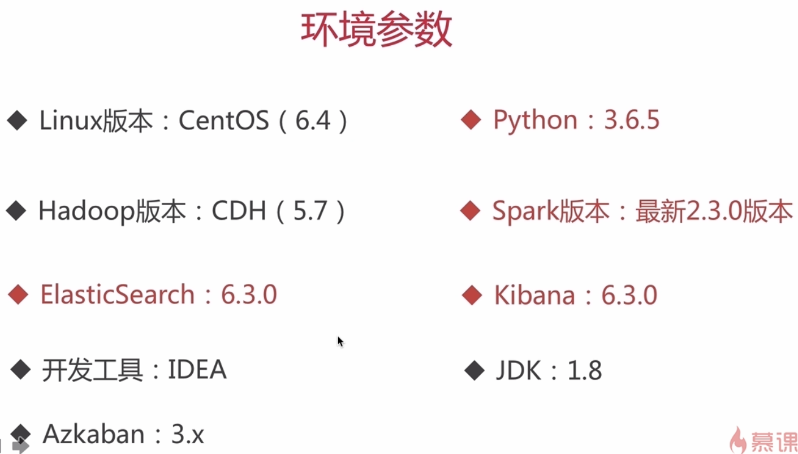

# 第2章 实战环境搭建

## 一、Python3环境部署

[下载网址](https://www.python.org/downloads/release/python-365/)

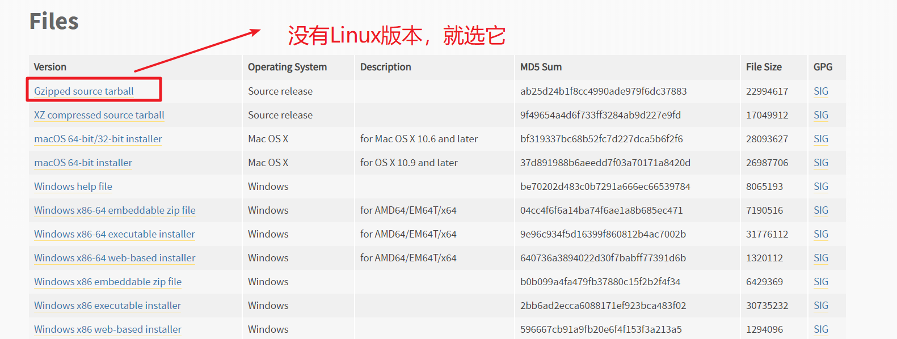

[参考网址](http://spark.apache.org/docs/latest/building-spark.html)

```
cd software/
```

```
wget https://www.python.org/ftp/python/3.6.5/Python-3.6.5.tgz
```

```
tar -zvxf Python-3.6.5.tgz -C ~/app/
```

--编译前安装依赖，python依赖安装

```
yum -y install zlib-devel bzip2-devel openssl-devel ncurses-devel sqlite-devel readline-devel tk-devel gdbm-devel db4-devel libpcap-devel xz-devel
```

```
cd Python-3.6.5/
```

```
./configure --prefix=/home/jungle/app/python3
```

```
make && make install
```

```
cd /home/jungle/app/python3/bin
pwd
```

--配置环境变量

```
vi ~/.bash_profile
```

```
export PATH=/home/jungle/app/python3/bin:$PATH
```

```
source ~/.bash_profile
```

## 二、Spark源码编译及部署

--Spark

```
./dev/make-distribution.sh --name 2.6.0-cdh5.7.0 --tgz  -Pyarn -Phadoop-2.6 -Phive -Phive-thriftserver -Dhadoop.version=2.6.0-cdh5.7.0
```

# 第3章 Spark Core核心RDD

## 一、RDD是什么

```

官网：xxxx.apache.org
源码：https://github.com/apache/xxxx


abstract class RDD[T: ClassTag](
    @transient private var _sc: SparkContext,
    @transient private var deps: Seq[Dependency[_]]
) extends Serializable with Logging

1）RDD是一个抽象类
2）带泛型的，可以支持多种类型： String、Person、User


RDD：Resilient Distributed Dataset   弹性 分布式 数据集

Represents an 
	immutable：不可变
	partitioned collection of elements ：分区
		Array(1,2,3,4,5,6,7,8,9,10)  3个分区： (1,2,3) (4,5,6) (7,8,9,10)
	that can be operated on in parallel： 并行计算的问题
```

```
单机存储/计算==>分布式存储/计算
1）数据的存储: 切割    HDFS的Block
2）数据的计算: 切割(分布式并行计算)   MapReduce/Spark
3）存储+计算 :   HDFS/S3+MapReduce/Spark
	
	==> OK 
```


## 二、RDD的五大特性

```
RDD的特性：	
Internally, each RDD is characterized by five main properties:
- A list of partitions
	一系列的分区/分片

- A function for computing each split/partition
	y = f(x)
	rdd.map(_+1)  

- A list of dependencies on other RDDs
	rdd1 ==> rdd2 ==> rdd3 ==> rdd4
	dependencies: *****

	rdda = 5个partition
	==>map
	rddb = 5个partition

- Optionally, a Partitioner for key-value RDDs (e.g. to say that the RDD is hash-partitioned)

- Optionally, a list of preferred locations to compute each split on (e.g. 
block locations for an HDFS file)

	数据在哪优先把作业调度到数据所在的节点进行计算：移动数据不如移动计算
	为什么location有s（location有多个？）
```

## 三、RDD特性在源码中的体现

```
五大特性源码体现：
def compute(split: Partition, context: TaskContext): Iterator[T] 特性二
def getPartitions: Array[Partition]  特性一
def getDependencies: Seq[Dependency[_]] = deps  特性三
def getPreferredLocations(split: Partition): Seq[String] = Nil  特性五
val partitioner: Option[Partitioner] = None  特性四
```

## 四、图解RDD

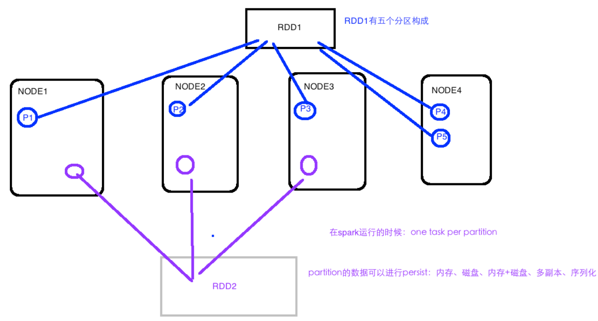

## 五、SparkContext&SparkConf详解

[参考网址](http://spark.apache.org/docs/latest/rdd-programming-guide.html)

```
第一要务：创建SparkContext
	连接到Spark“集群”：local、standalone、yarn、mesos
	通过SparkContext来创建RDD、广播变量到集群

在创建SparkContext之前还需要创建一个SparkConf对象
```

## 六、pyspark

```
cd $SPARK_HOME/bin/
```

```
pyspark --master local[2] --jars /home/jungle/app/hive-1.1.0-cdh5.7.0/lib/mysql-connector-java-5.1.27-bin.jar
```

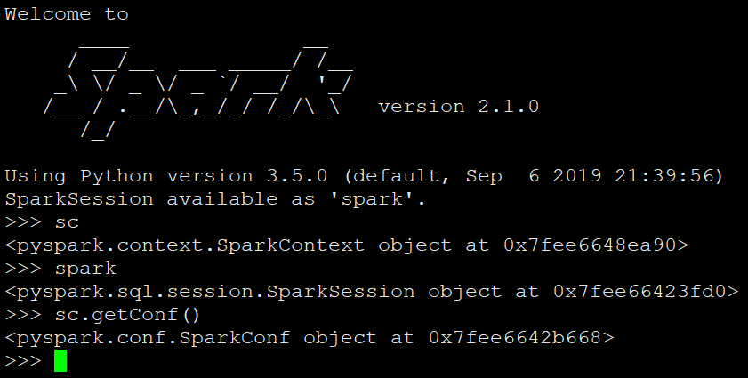

​    ==UI界面==

```
http://192.168.1.18:4040
```

```
vi ~/.bash_profile
```

```
export PYSPARK_PYTHON=python3.5
```

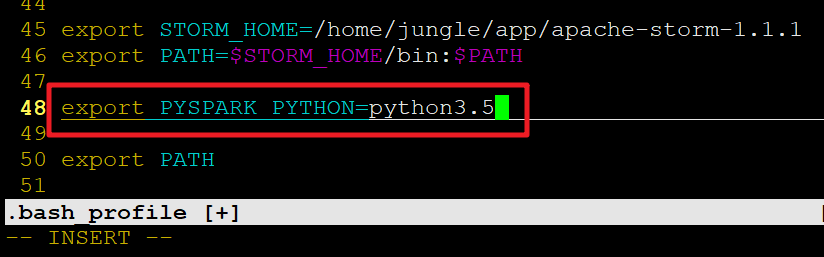

```
source ~/.bash_profile
```

## 七、RDD的创建

### 1.[方式一（Parallelized Collections）](http://spark.apache.org/docs/latest/rdd-programming-guide.html#parallelized-collections)

```
pyspark --master local[2] --jars /home/jungle/app/hive-1.1.0-cdh5.7.0/lib/mysql-connector-java-5.1.27-bin.jar
```

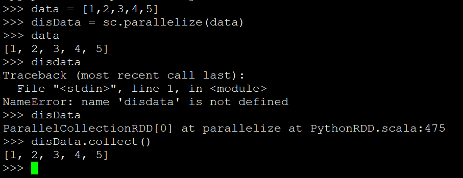

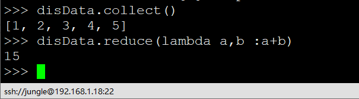

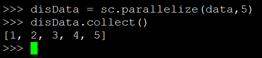

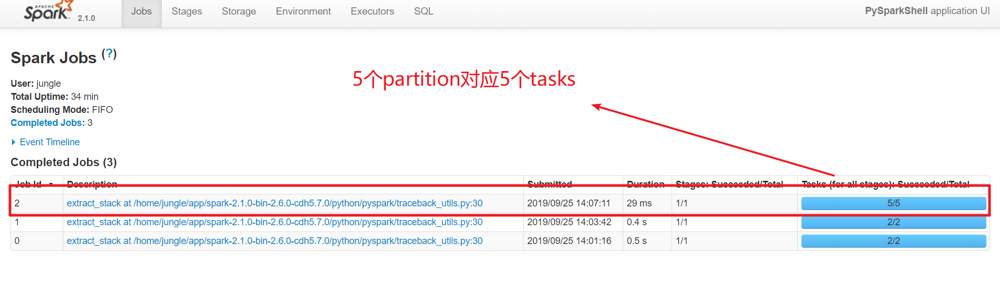

### 2.[方式二(External Datasets)](http://spark.apache.org/docs/latest/rdd-programming-guide.html#external-datasets)

```
cd data
vi hello.txt
```


```
sc.textFile("file:///home/jungle/data/hello.txt").collect()
```

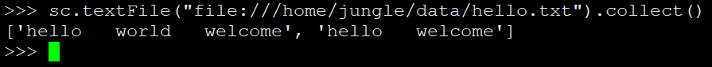

```
hadoop fs -put hello.txt /
hadoop fs -text /hello.txt
```

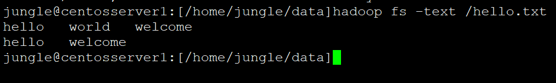

```
sc.textFile("hdfs://192.168.1.18:8020/hello.txt").collect()
```

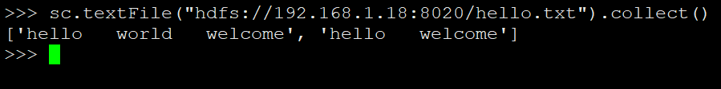

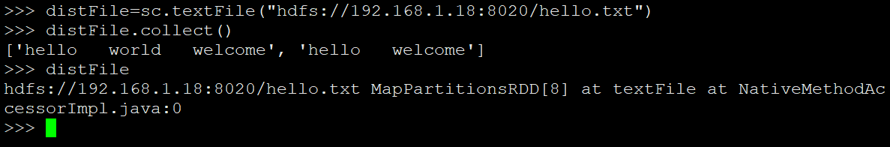

==注意==

```
If using a path on the local filesystem, the file must also be accessible at the same path on worker nodes
	1）我们上课是在单节点上的：一个节点， hello.txt只要在这台机器上有就行了
	2）standalone: Spark集群： 3个节点  local path 都是从节点的本地读取数据  不建议
```

+ 写入文件系统

  ```
  disData = sc.parallelize(data)
  disData.saveAsTextFile("file:///home/jungle/data/output")
  ```

  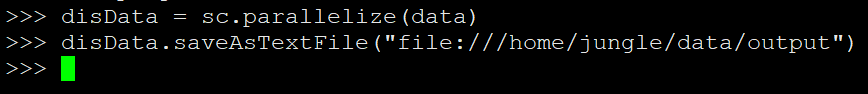

  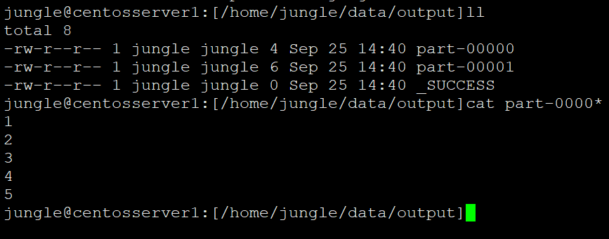

## 八、使用IDE开发pyspark应用程序

```
开发pyspark应用程序
	1) IDE: IDEA  pycharm
	2) 设置基本参数: python interceptor    PYTHONPATH   SPARK_HOME   2zip包
	3）开发
	4）使用local进行本地测试
```

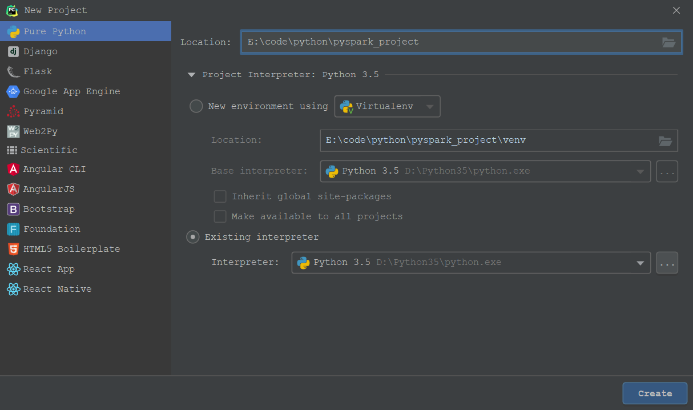

### 1.环境设置

----


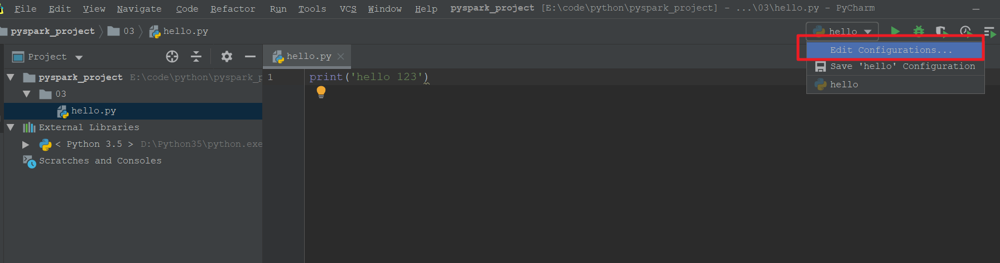

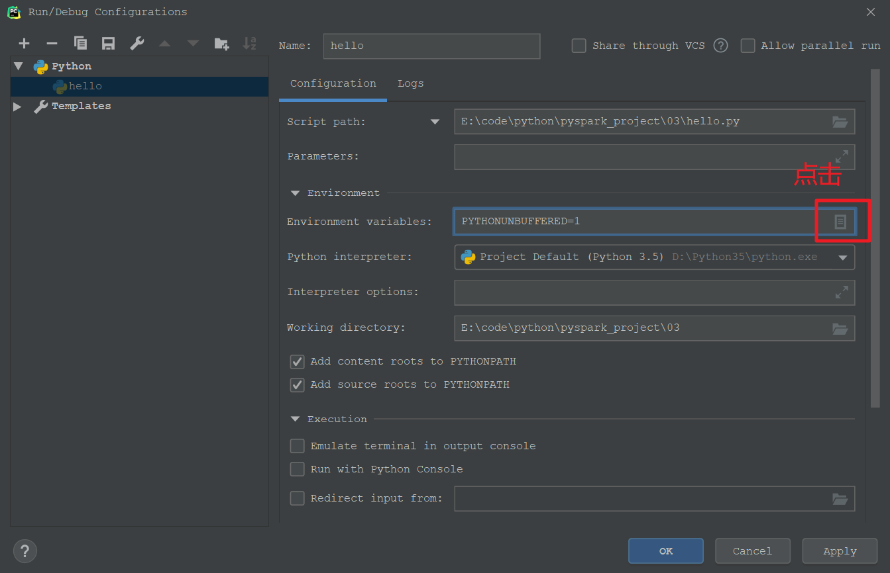

```
PYTHONPATH:E:\spark-2.1.0-bin-2.6.0-cdh5.7.0\python
SPARK_HOME:E:\spark-2.1.0-bin-2.6.0-cdh5.7.0
```

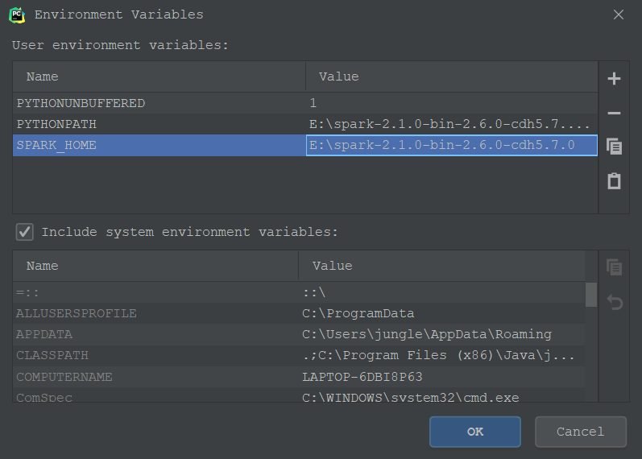

---

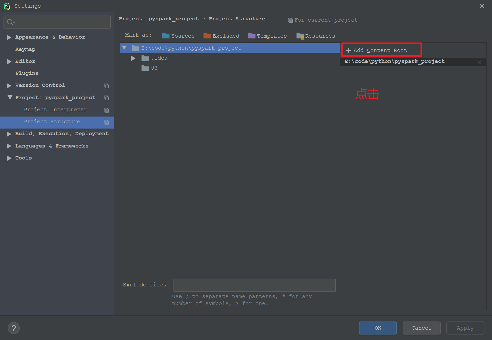

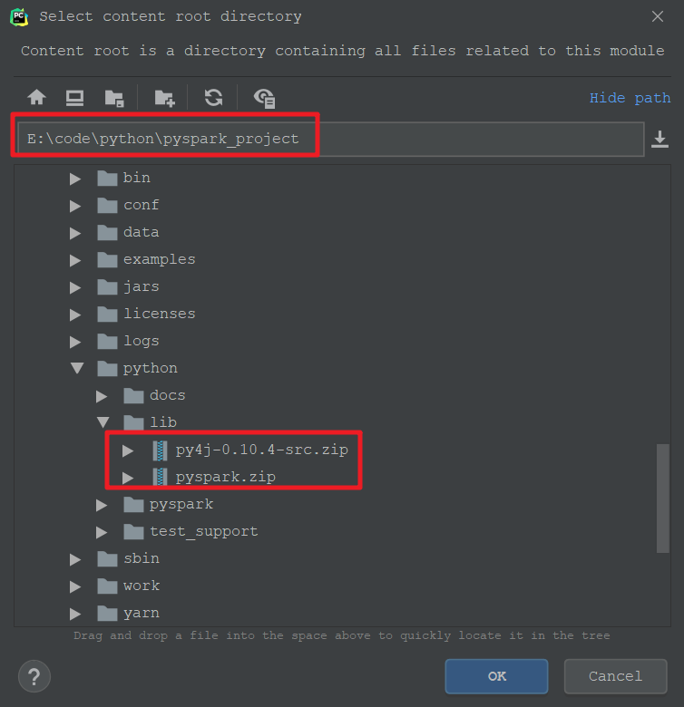

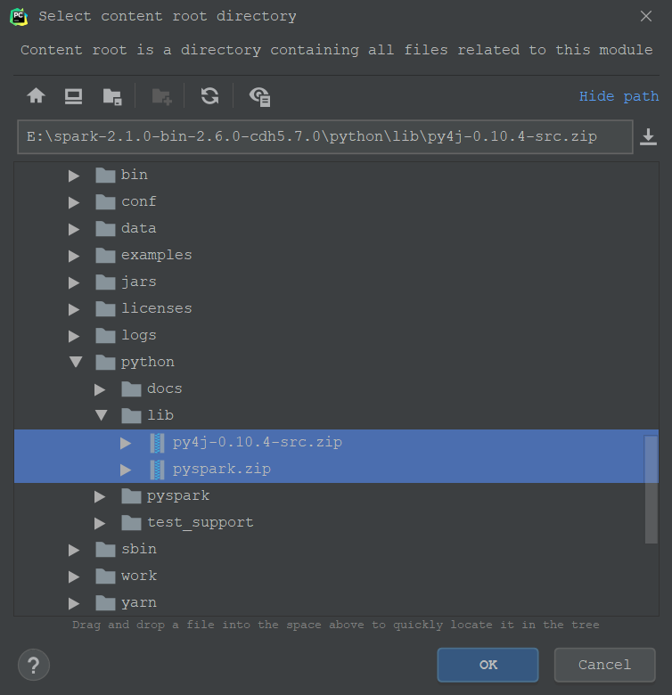

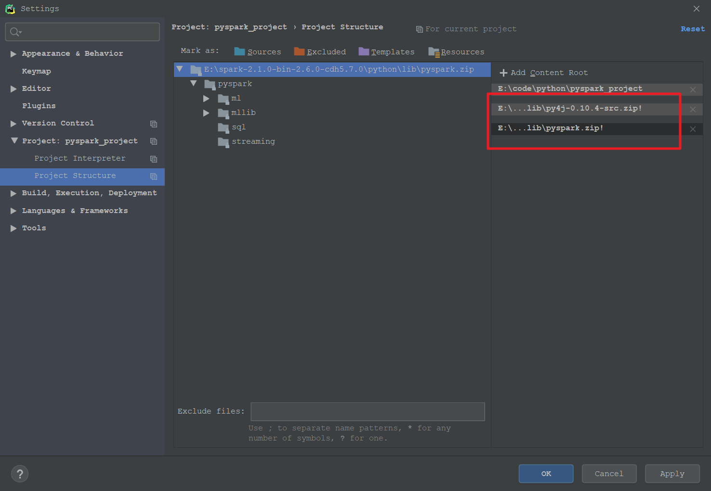

### 2.程序

--spark0301.py

```python
from pyspark import SparkConf,SparkContext

# 创建SparkConf：设置的是Spark相关的参数信息
conf = SparkConf().setMaster("local[2]").setAppName("spark0301")

# 创建SparkContext
sc = SparkContext(conf=conf)

# 业务逻辑
data = [1,2,3,4,5]
distData = sc.parallelize(data)
print(distData.collect())

# 好的习惯
sc.stop()
```

==运行结果==

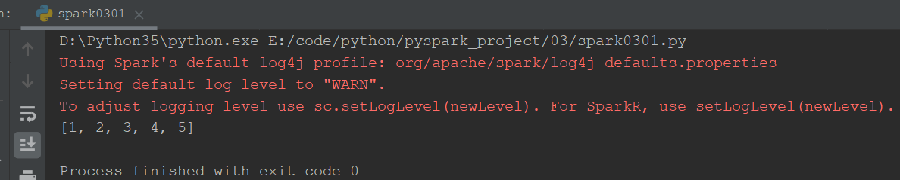

## 九、提交pyspark作业到服务器上运行

```
mkdir script
cd script/
```

```
vi spark0301.py
```

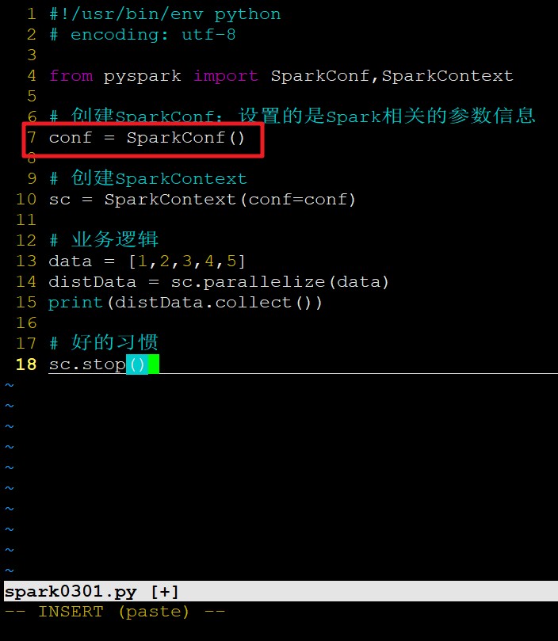

==提交任务==

```
cd $SPARK_HOME/bin/
```

```
./spark-submit --master local[2] --name spark0301 /home/jungle/script/spark0301.py 
```

==报错==

> Exception in thread "main" java.io.IOException: Cannot run program "python3.5": error=2, No such file or directory

改正：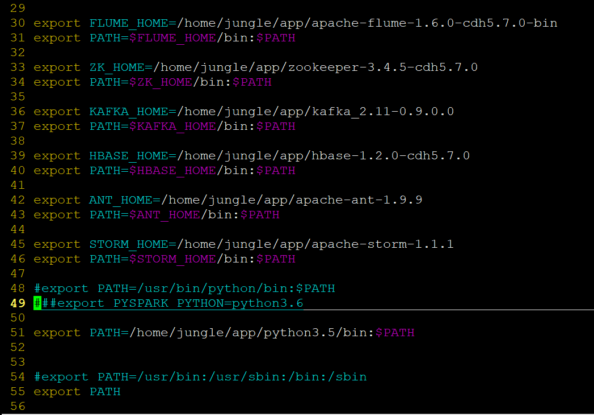

----


# 第4章 Spark Core RDD编程

## 一、RDD常用操作

 [RDD Operations](http://spark.apache.org/docs/latest/rdd-programming-guide.html#rdd-operations)

```
RDD Operation
	transformations: create a new dataset from an existing one
		RDDA ---transformation--> RDDB
		# 举个例子
		y = f(x)
		rddb = rdda.map(....)


		lazy(*****)
		# 遇到collect才计算
			rdda.map().filter()......collect
		# transformation
		map/filter/group by/distinct/.....

	actions: 
		return a value to the driver program after running a computation on the dataset
		# actions
		count/reduce/collect......
		
	# 特点
	1) transformation are lazy, nothing actually happens until an action is called;
	2) action triggers the computation;
	3) action returns values to driver or writes data to external storage;
```

+ 程序

  ```python
  from pyspark import SparkConf, SparkContext
  
  if __name__ == '__main__':
      conf = SparkConf().setMaster("local[2]").setAppName("spark0401")
      sc = SparkContext(conf = conf)
  
      def my_map():
          data = [1,2,3,4,5]
          # 变成RDD
          rdd1 = sc.parallelize(data)
          rdd2 = rdd1.map(lambda x:x*2)
          # 输出collect()
          print(rdd2.collect())
  
  
      def my_map2():
          a = sc.parallelize(["dog", "tiger", "lion", "cat", "panther", " eagle"])
          b = a.map(lambda x:(x,1))
          print(b.collect())
  
  
      def my_filter():
          data = [1,2,3,4,5]
          rdd1 = sc.parallelize(data)
          mapRdd = rdd1.map(lambda x:x*2)
          filterRdd = mapRdd.filter(lambda x:x>5)
          print(filterRdd.collect())
  
          print(sc.parallelize(data).map(lambda x:x*2).filter(lambda x:x>5).collect())
  
  
      def my_flatMap():
          data = ["hello spark","hello world","hello world"]
          rdd = sc.parallelize(data)
          print(rdd.flatMap(lambda line:line.split(" ")).collect())
  
  
      def my_groupBy():
          data = ["hello spark", "hello world", "hello world"]
          rdd = sc.parallelize(data)
          mapRdd = rdd.flatMap(lambda line:line.split(" ")).map(lambda x:(x,1))
          groupByRdd = mapRdd.groupByKey()
          print(groupByRdd.collect())
          print(groupByRdd.map(lambda x:{x[0]:list(x[1])}).collect())
  
  
      def my_reduceByKey():
          data = ["hello spark", "hello world", "hello world"]
          rdd = sc.parallelize(data)
          mapRdd = rdd.flatMap(lambda line: line.split(" ")).map(lambda x: (x, 1))
          reduceByKeyRdd = mapRdd.reduceByKey(lambda a,b:a+b)
  
  
      def my_sort():
          data = ["hello spark", "hello world", "hello world"]
          rdd = sc.parallelize(data)
          mapRdd = rdd.flatMap(lambda line: line.split(" ")).map(lambda x: (x, 1))
          reduceByKeyRdd = mapRdd.reduceByKey(lambda a, b: a + b)
          reduceByKeyRdd.sortByKey(False).collect()
  
          reduceByKeyRdd.map(lambda x:(x[1],x[0])).sortByKey(False).map(lambda x:(x[1],x[0])).collect()
  
      def my_union():
          a = sc.parallelize([1,2,3])
          b = sc.parallelize([3,4,5])
          print(a.union(b).collect())
  
      def my_distinct():
          a = sc.parallelize([1, 2, 3])
          b = sc.parallelize([3, 4, 2])
          a.union(b).distinct().collect()
  
      def my_join():
          a = sc.parallelize([("A", "a1"), ("C", "c1"), ("D", "d1"), ("F", "f1"), ("F", "f2")])
          b = sc.parallelize([("A", "a2"), ("C", "c2"), ("C", "c3"), ("E", "e1")])
  
          # a.join(b).collect
          # a.leftOuterJoin(b).collect
          # a.rightOuterJoin(b).collect
          a.fullOuterJoin(b).collect
  
  
  
      def my_action():
          data = [1,2,3,4,5,6,7,8,9,10]
          rdd = sc.parallelize(data)
          rdd.collect()
          rdd.reduce(lambda x,y:x+y)
  
          rdd.foreach(lambda x:print(x))
      my_union()
      sc.stop()
  ```

  

## 二、transformation算子使用

### 1.map算子使用详解

```
map: 
	map(func)
	将func函数作用到数据集的每一个元素上，生成一个新的分布式的数据集返回

	word => (word,1)
```

​	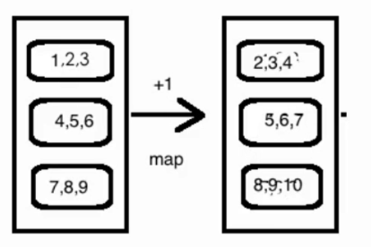

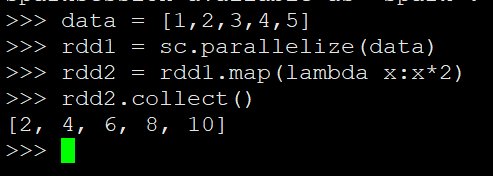

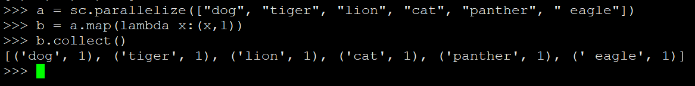

### 2.filter算子详解

```
filter:
	filter(func)
	选出所有func返回值为true的元素，生成一个新的分布式的数据集返回
```

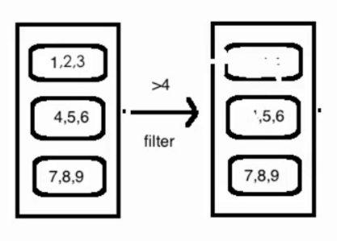

### 3.flatMap算子详解

```
flatMap
	flatMap(func)
	输入的item能够被map到0或者多个items输出，返回值是一个Sequence
```

### 4.groupByKey算子详解

```
groupByKey：把相同的key的数据分发到一起
	['hello', 'spark', 'hello', 'world', 'hello', 'world']
	('hello',1) ('spark',1)........
```

### 5.reduceByKey算子详解

```
reduceByKey: 把相同的key的数据分发到一起并进行相应的计算
	 mapRdd.reduceByKey(lambda a,b:a+b)
	 [1,1]  1+1
	 [1,1,1]  1+1=2+1=3
	 [1]    1
```

### 6.sortByKey算子详解

```
需求: 请按wc结果中出现的次数降序排列  sortByKey
	('hello', 3), ('world', 2),  ('spark', 1)
```

```python
    def my_sort():
        data = ["hello spark", "hello world", "hello world"]
        rdd = sc.parallelize(data)
        mapRdd = rdd.flatMap(lambda line: line.split(" ")).map(lambda x: (x, 1))
        reduceByKeyRdd = mapRdd.reduceByKey(lambda a, b: a + b)
        reduceByKeyRdd.sortByKey(False).collect()

        reduceByKeyRdd.map(lambda x:(x[1],x[0])).sortByKey(False).map(lambda x:(x[1],x[0])).collect()
```

### 7.union算子使用详解

--合并

```python
    def my_union():
        a = sc.parallelize([1,2,3])
        b = sc.parallelize([3,4,5])
        print(a.union(b).collect())
```

### 8.distinct算子使用详解

--去重

```python
    def my_distinct():
        a = sc.parallelize([1, 2, 3])
        b = sc.parallelize([3, 4, 2])
        a.union(b).distinct().collect()
```

### 9.join算子详解

```
join： 
	inner join
	outer join:left/right/full
```

```python
    def my_join():
        a = sc.parallelize([("A", "a1"), ("C", "c1"), ("D", "d1"), ("F", "f1"), ("F", "f2")])
        b = sc.parallelize([("A", "a2"), ("C", "c2"), ("C", "c3"), ("E", "e1")])

        # a.join(b).collect
        # a.leftOuterJoin(b).collect
        # a.rightOuterJoin(b).collect
        a.fullOuterJoin(b).collect
```

## 三、action常用算子详解

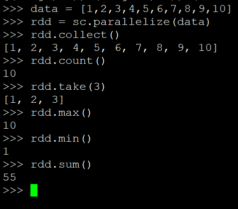

```python
    def my_action():
        data = [1,2,3,4,5,6,7,8,9,10]
        rdd = sc.parallelize(data)
        rdd.collect()
        rdd.reduce(lambda x,y:x+y)

        rdd.foreach(lambda x:print(x))
```

## 四、算子综合案例实战

### 1.词频统计

```
词频案例:wc
	1) input: 1/n文件  文件夹  后缀名
		hello spark    
		hello hadoop
		hello welcome
	2) 开发步骤分析
		文本内容的每一行转成一个个的单词 : flatMap
		单词 ==> (单词, 1):  map
		把所有相同单词的计数相加得到最终的结果: reduceByKey
```

--程序

```python
import sys

from pyspark import SparkConf, SparkContext

if __name__ == '__main__':

    if len(sys.argv) != 3:
        print("Usage: wordcount <input> <output>", file=sys.stderr)
        sys.exit(-1)

    conf = SparkConf()
    sc = SparkContext(conf=conf)

    def printResult():
        counts = sc.textFile(sys.argv[1]) \
            .flatMap(lambda line: line.split("\t")) \
            .map(lambda x: (x, 1)) \
            .reduceByKey(lambda a, b: a + b)

        output = counts.collect()

        for (word, count) in output:
            print("%s: %i" % (word, count))


    def saveFile():
        sc.textFile(sys.argv[1]) \
            .flatMap(lambda line: line.split("\t")) \
            .map(lambda x: (x, 1)) \
            .reduceByKey(lambda a, b: a + b)\
            .saveAsTextFile(sys.argv[2])

    saveFile()

    sc.stop()
```

--输入参数

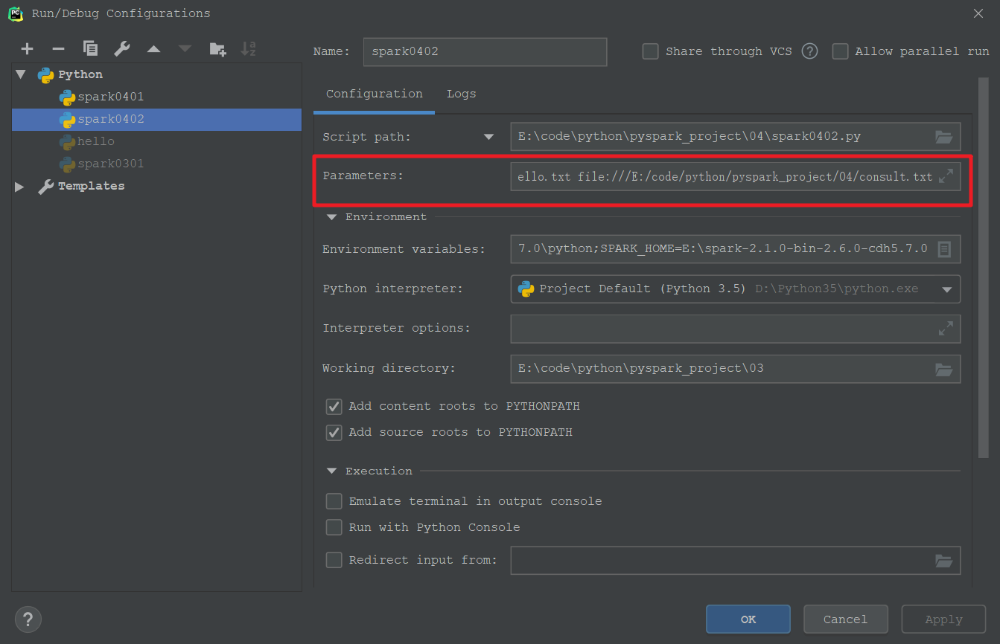

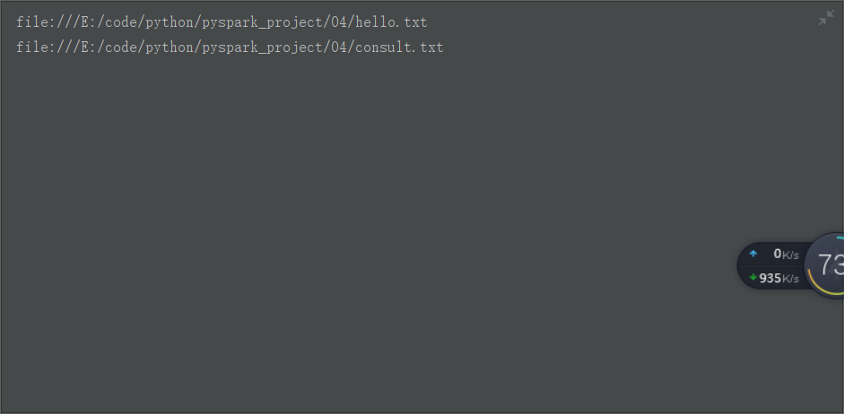

```
file:///E:/code/python/pyspark_project/04/hello.txt
file:///E:/code/python/pyspark_project/04/consult
```

+ 服务器上运行

```
spark-submit --master local[2] --name spark0402 /home/jungle/script/spark0402.py file:///home/jungle/data/hello.txt file:///home/jungle/data/wc
```

  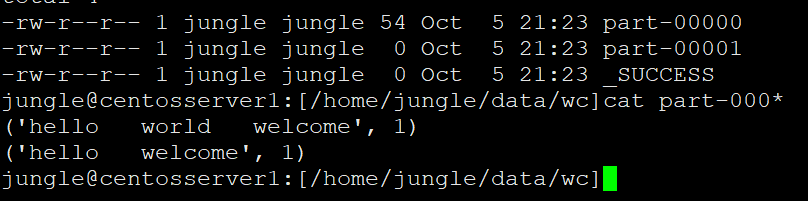

### 2.TopN统计

```
TopN
	1) input : 1/n文件  文件夹  后缀名
	2) 求某个维度的topn
	3）开发步骤分析
		文本内容的每一行根据需求提取出你所需要的字段： map
		单词 ==> (单词, 1):  map
		把所有相同单词的计数相加得到最终的结果: reduceByKey
		取最多出现次数的降序： sortByKey

```

--程序

```python
import sys

from pyspark import SparkConf, SparkContext

if __name__ == '__main__':

    if len(sys.argv) != 2:
        print("Usage: topn <input>", file=sys.stderr)
        sys.exit(-1)

    conf = SparkConf()
    sc = SparkContext(conf=conf)

    counts = sc.textFile(sys.argv[1])\
        .map(lambda x:x.split("\t"))\
        .map(lambda x:(x[5],1))\
        .reduceByKey(lambda a,b:a+b)\
        .map(lambda x:(x[1],x[0]))\
        .sortByKey(False)\
        .map(lambda x:(x[1],x[0])).take(5)

    for (word, count) in counts:
        print("%s: %i" % (word, count))


    sc.stop()
```


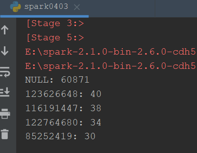

### 3.平均数统计

```
平均数：统计平均年龄
id age
3 96
4 44
5 67
6 4
7 98
	开发步骤分析：
	1) 取出年龄  map
	2）计算年龄综合 reduce
	3）计算记录总数 count
	4）求平均数  
```

--程序

```python
import sys

from pyspark import SparkConf, SparkContext

if __name__ == '__main__':

    if len(sys.argv) != 2:
        print("Usage: avg <input>", file=sys.stderr)
        sys.exit(-1)

    conf = SparkConf()
    sc = SparkContext(conf=conf)

    ageData = sc.textFile(sys.argv[1]).map(lambda x:x.split(" ")[1])
    # map(lambda age:int(age))类型转换
    totalAge = ageData.map(lambda age:int(age)).reduce(lambda a,b:a+b)
    counts = ageData.count()
    avgAge = totalAge/counts

    print(counts)
    print(totalAge)
    print(avgAge)

    sc.stop()
```

# 第5章 Spark运行模式

## 一、local模式运行

[网址](http://spark.apache.org/docs/latest/submitting-applications.html)

```
Local模式：
	开发

	--master
	--name
	--py-files
```

```
spark-submit --master local[2] --name spark-local /home/jungle/script/spark0402.py file:///home/jungle/data/hello.txt file:///home/jungle/wc/output
```

## 二、standalone模式环境搭建

[网址](http://spark.apache.org/docs/latest/spark-standalone.html)

```
standalone 
	hdfs: NameNode  DataNode
	yarn: ResourceManager NodeManager

	master:
	worker:
	
	cd $SPARK_HOME/conf/
	cp slaves.template slaves
	$SPARK_HOME/conf/slaves
		hadoop000

		假设你有5台机器，就应该进行如下slaves的配置
		hadoop000
		hadoop001
		hadoop002
		hadoop003
		hadoop005
		如果是多台机器，那么每台机器都在相同的路径下部署spark

	启动spark集群
		$SPARK_HOME/sbin/start-all.sh
		ps: 要在spark-env.sh中添加JAVA_HOME，否则会报错
		检测： 
			jps： Master和Worker进程，就说明我们的standalone模式安装成功
			webui：
# pyspark运行
./pyspark --master spark://hadoop000:7077

# spark-submit运行
./spark-submit --master spark://hadoop000:7077 --name spark-standalone /home/jungle/script/spark0402.py hdfs://hadoop000:8020/wc.txt hdfs://hadoop000:8020/wc/output

	如果使用standalone模式，而且你的节点个数大于1的时候，如果你使用本地文件测试，必须要保证每个节点上都有本地测试文件
```

## 三、yarn运行模式详解

[网址](http://spark.apache.org/docs/latest/running-on-yarn.html)

```
yarn
	mapreduce yarn
	spark on yarn 70%
	spark作业客户端而已，他需要做的事情就是提交作业到yarn上去执行
	yarn vs standalone
		yarn： 你只需要一个节点，然后提交作业即可   这个是不需要spark集群的（不需要启动master和worker的）
		standalone：你的spark集群上每个节点都需要部署spark，然后需要启动spark集群（需要master和worker）


./spark-submit --master yarn --name spark-yarn /home/hadoop/script/spark0402.py hdfs://hadoop000:8020/wc.txt hdfs://hadoop000:8020/wc/output

When running with master 'yarn' either HADOOP_CONF_DIR or YARN_CONF_DIR must be set in the environment


作业：试想：为什么需要指定HADOOP_CONF_DIR或者YARN_CONF_DIR

如何使得这个信息规避掉
Neither spark.yarn.jars nor spark.yarn.archive is set, falling back to uploading libraries under SPARK_HOME

yarn支持client和cluster模式：driver运行在哪里
	client：提交作业的进程是不能停止的，否则作业就挂了
	cluster：提交完作业，那么提交作业端就可以断开了，因为driver是运行在am里面的


Error: Cluster deploy mode is not applicable to Spark shells

	pyspark/spark-shell : 交互式运行程序  client
	spark-sql

如何查看已经运行完的yarn的日志信息： yarn logs -applicationId <applicationId>
Log aggregation has not completed or is not enabled.
参见：https://coding.imooc.com/class/chapter/128.html#Anchor  JobHistory使用


不管你的spark应用程序运行在哪里，你的spark代码都是一样的，不需要做任何的修改和调整，所以spark使用起来是非常方便的！！！！！！
```


+ 配置

```
cd $SPARK_HOME/conf
cp spark-env.sh.template spark-env.sh
vi spark-env.sh
```

```
JAVA_HOME=/home/jungle/app/jdk1.8.0_152                           
HADOOP_CONF_DIR=/home/jungle/app/hadoop-2.6.0-cdh5.7.0/etc/hadoop 
```

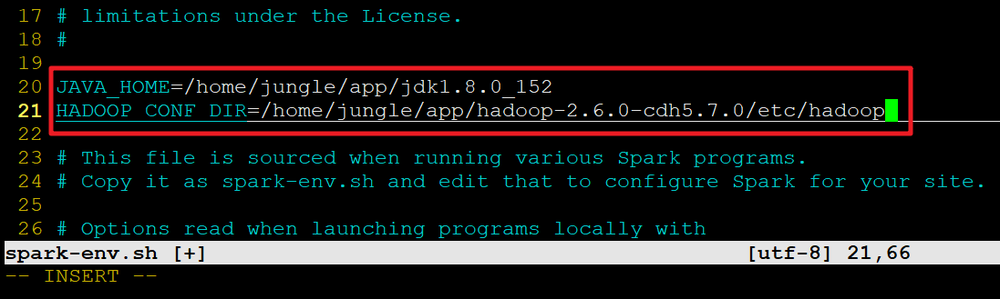

> hadoop配置文件均在该文件`/home/jungle/app/hadoop-2.6.0-cdh5.7.0/etc/hadoop`下

+ 提交

  ```
  spark-submit --master yarn --name spark-yarn /home/jungle/script/spark0402.py hdfs://centosserver1:8020/hello.txt hdfs://centosserver1:8020/wc/output
  ```

  

==报错==

> Randomness of hash of string should be disabled via PYTHONHASHSEED

--解决

```
cp spark-defaults.conf.template spark-defaults.conf
vi spark-defaults.conf
```

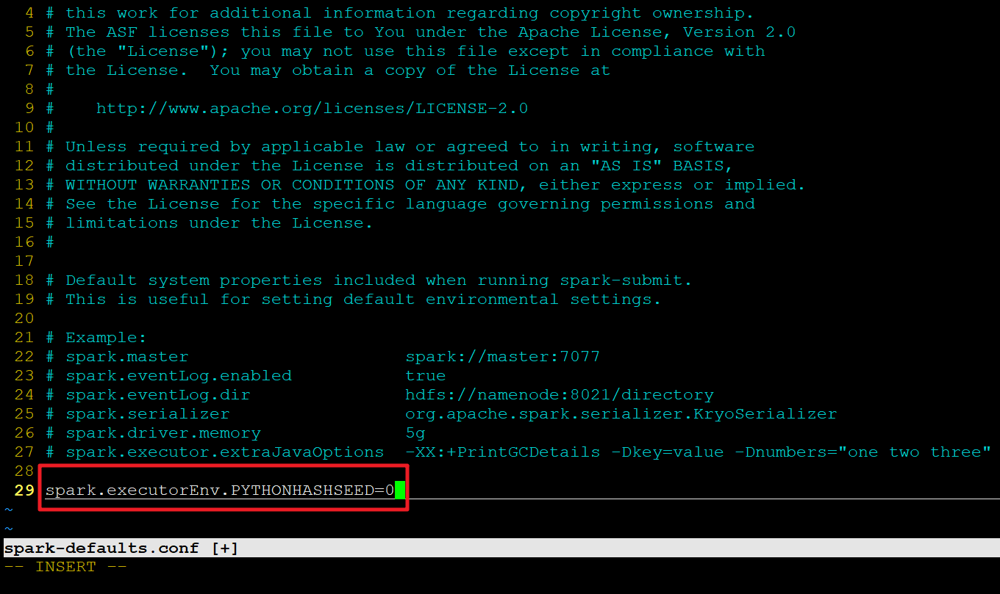

```
spark.executorEnv.PYTHONHASHSEED=0
```

> 等号后的0也可以是其他值

+ pyspark

  ```
  pyspark --master yarn
  ```

  

# 第6章 Spark Core进阶

## 一、Spark核心概念详解

[网址](http://spark.apache.org/docs/latest/cluster-overview.html#glossary)

```
Spark核心概述
	Application	：基于Spark的应用程序 =  1 driver + executors
		User program built on Spark. 
		Consists of a driver program and executors on the cluster.
		for example:
			spark0402.py
			pyspark/spark-shell

	Driver program	
		process:进程
		The process running the main() function of the application 
		creating the SparkContext	

	Cluster manager 获取资源
		An external service for acquiring resources on the cluster (e.g. standalone manager, Mesos, YARN)	
		for example:
			spark-submit --master local[2]/spark://hadoop000:7077/yarn

	Deploy mode	
		Distinguishes：区分
		Distinguishes where the driver process runs. 
			In "cluster" mode, the framework launches the driver inside of the cluster. 
			In "client" mode, the submitter launches the driver outside of the cluster.	

	Worker node	
		Any node that can run application code in the cluster
		for example:
			standalone: slave节点 slaves配置文件
			yarn: nodemanager


	Executor	
		A process launched for an application on a worker node
		runs tasks 
		keeps data in memory or disk storage across them
		Each application has its own executors.	


	Task	
		A unit of work that will be sent to one executor
		for example:
			map
			filter

	Job	
		A parallel computation consisting of multiple tasks that 
		gets spawned(产生) in response to a Spark action (e.g. save, collect); 
		you'll see this term used in the driver's logs.
		一个action对应一个job

	Stage	
		Each job gets divided into smaller sets of tasks called stages 
		that depend on each other
		(similar to the map and reduce stages in MapReduce); 
		you'll see this term used in the driver's logs.	
		一个stage的边界往往是从某个地方取数据开始，到shuffle的结束
```

Standalone模式

--启动节点

```
cd $SPARK_HOME/sbin
./start-all.sh
```

> 访问http://192.168.1.18:8080/

--关闭节点

```
cd $SPARK_HOME/sbin
./stop-all.sh
```

```
pyspark --master spark://centosserver1:7077
```

> 报错：javax.jdo.JDOFatalInternalException: Error creating transactional connection factory

==解决==

--方法一

```
pyspark --master spark://centosserver1:7077  --driver-class-path /home/jungle/app/hive-1.1.0-cdh5.7.0/lib/mysql-connector-java-5.1.27-bin.jar
```

--方法二

原因:可能是没有添加jdbc的驱动
 解决办法: Spark 中如果没有配置连接驱动，在spark/conf 目录下编辑spark-env.sh 添加驱动配置

```
cd $SPARK_HOME/conf
vi spark-env.sh
```

```
export SPARK_CLASSPATH=$SPARK_CLASSPATH:/home/jungle/app/hive-1.1.0-cdh5.7.0/lib/mysql-connector-java-5.1.27-bin.jar
```

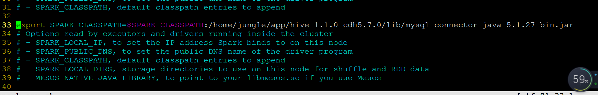

+ 测试

  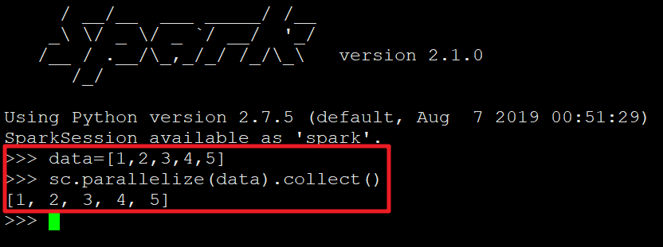

> 访问http://192.168.1.18:4040/

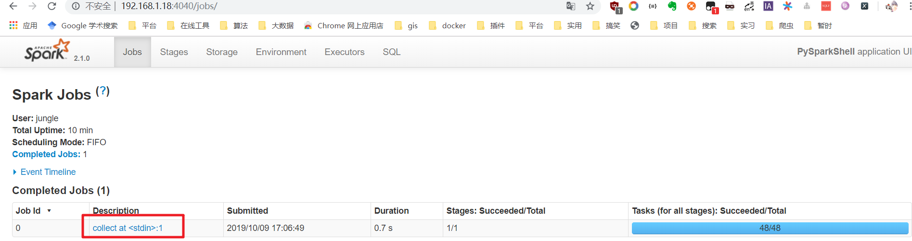

## 二、Spark运行架构及注意事项

[网址](http://spark.apache.org/docs/latest/cluster-overview.html#components)


1. Each application gets its own executor processes, which stay up for the duration of the whole application and run tasks in multiple threads. This has the benefit of isolating applications from each other, on both the scheduling side (each driver schedules its own tasks) and executor side (tasks from different applications run in different JVMs). However, it also means that data cannot be shared across different Spark applications (instances of SparkContext) without writing it to an external storage system.
2. Spark is agnostic to the underlying cluster manager. As long as it can acquire executor processes, and these communicate with each other, it is relatively easy to run it even on a cluster manager that also supports other applications (e.g. Mesos/YARN).
3. The driver program must listen for and accept incoming connections from its executors throughout its lifetime (e.g., see [spark.driver.port in the network config section](http://spark.apache.org/docs/latest/configuration.html#networking)). As such, the driver program must be network addressable from the worker nodes.
4. Because the driver schedules tasks on the cluster, it should be run close to the worker nodes, preferably on the same local area network. If you’d like to send requests to the cluster remotely, it’s better to open an RPC to the driver and have it submit operations from nearby than to run a driver far away from the worker nodes.

## 三、Spark和Hadoop重要概念区分

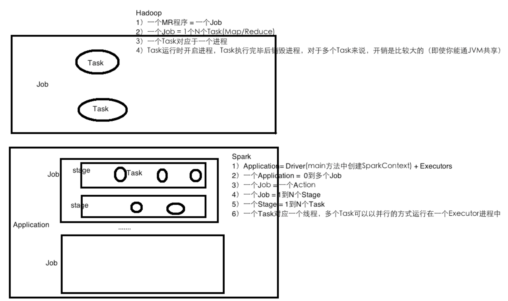


## 四、Spark缓存

### 1.作用

```
Spark Cache
	rdd.cache(): StorageLevel

	cache它和tranformation: lazy   没有遇到action是不会提交作业到spark上运行的

	如果一个RDD在后续的计算中可能会被使用到，那么建议cache

	cache底层调用的是persist方法，传入的参数是：StorageLevel.MEMORY_ONLY
	cache=persist
```

```
# 查看文件大小
ll -lh
```

```
pyspark
```

```
lines=sc.textFile("file:///home/jungle/data/page_views.dat")
lines.count()
```

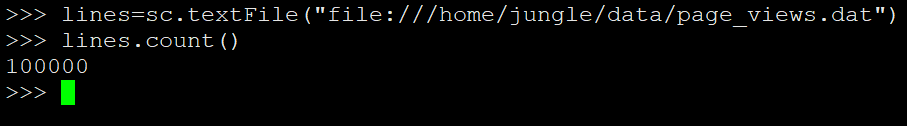

```
lines.cache()
```

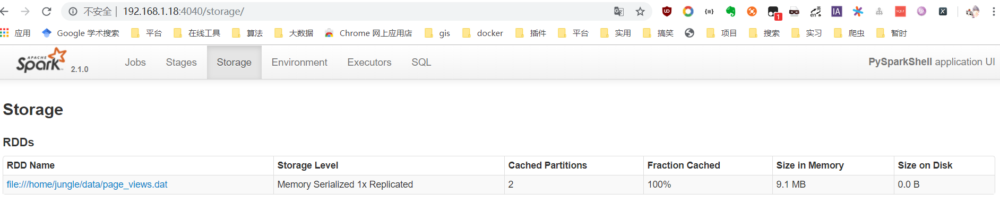

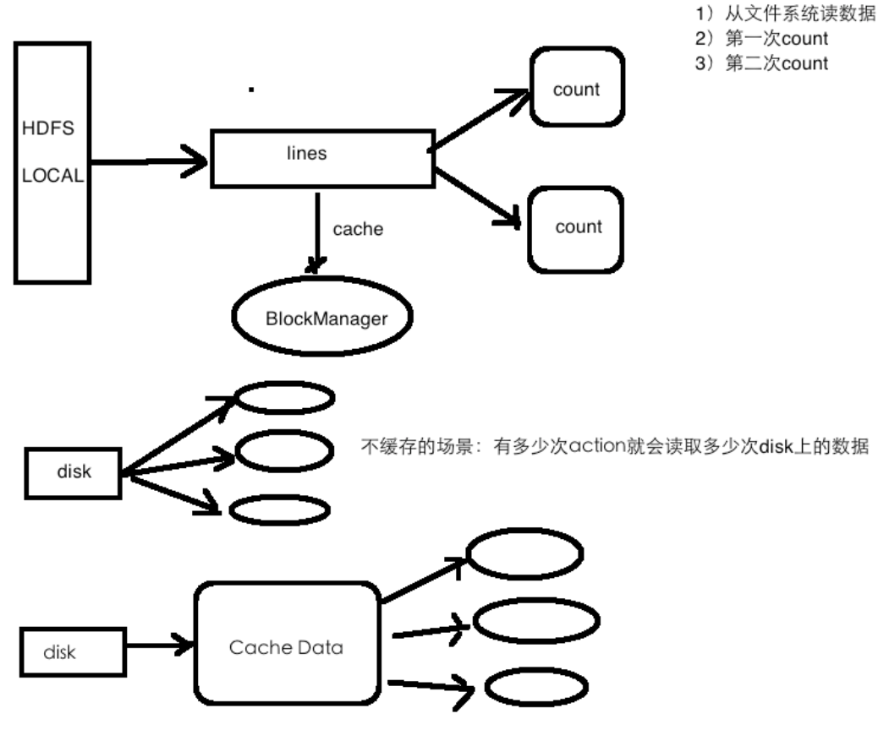

### 2.缓存概述

[网址](http://spark.apache.org/docs/latest/rdd-programming-guide.html#rdd-persistence)

One of the most important capabilities in Spark is *persisting* (or *caching*) a dataset in memory across operations. When you persist an RDD, each node stores any partitions of it that it computes in memory and reuses them in other actions on that dataset (or datasets derived from it). This allows future actions to be much faster (often by more than 10x). Caching is a key tool for iterative algorithms and fast interactive use.

You can mark an RDD to be persisted using the `persist()` or `cache()` methods on it. The first time it is computed in an action, it will be kept in memory on the nodes. Spark’s cache is fault-tolerant – if any partition of an RDD is lost, it will automatically be recomputed using the transformations that originally created it.

In addition, each persisted RDD can be stored using a different *storage level*, allowing you, for example, to persist the dataset on disk, persist it in memory but as serialized Java objects (to save space), replicate it across nodes. These levels are set by passing a `StorageLevel` object ([Scala](http://spark.apache.org/docs/latest/api/scala/index.html#org.apache.spark.storage.StorageLevel), [Java](http://spark.apache.org/docs/latest/api/java/index.html?org/apache/spark/storage/StorageLevel.html), [Python](http://spark.apache.org/docs/latest/api/python/pyspark.html#pyspark.StorageLevel)) to `persist()`. The `cache()` method is a shorthand for using the default storage level, which is `StorageLevel.MEMORY_ONLY` (store deserialized objects in memory). The full set of storage levels is:

| Storage Level                          | Meaning                                                      |
| :------------------------------------- | :----------------------------------------------------------- |
| MEMORY_ONLY                            | Store RDD as deserialized Java objects in the JVM. If the RDD does not fit in memory, some partitions will not be cached and will be recomputed on the fly each time they're needed. This is the default level. |
| MEMORY_AND_DISK                        | Store RDD as deserialized Java objects in the JVM. If the RDD does not fit in memory, store the partitions that don't fit on disk, and read them from there when they're needed. |
| MEMORY_ONLY_SER (Java and Scala)       | Store RDD as *serialized* Java objects (one byte array per partition). This is generally more space-efficient than deserialized objects, especially when using a [fast serializer](http://spark.apache.org/docs/latest/tuning.html), but more CPU-intensive to read. |
| MEMORY_AND_DISK_SER (Java and Scala)   | Similar to MEMORY_ONLY_SER, but spill partitions that don't fit in memory to disk instead of recomputing them on the fly each time they're needed. |
| DISK_ONLY                              | Store the RDD partitions only on disk.                       |
| MEMORY_ONLY_2, MEMORY_AND_DISK_2, etc. | Same as the levels above, but replicate each partition on two cluster nodes. |
| OFF_HEAP (experimental)                | Similar to MEMORY_ONLY_SER, but store the data in [off-heap memory](http://spark.apache.org/docs/latest/configuration.html#memory-management). This requires off-heap memory to be enabled. |

### 3.缓存策略详解

```
# 删除缓存内容
unpersist: 立即执行的
```

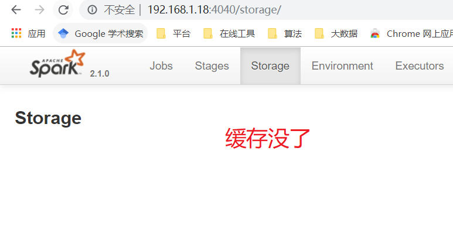

+ 测试

  ```
  from pyspark import StorageLevel
  lines.persist(StorageLevel.MEMORY_ONLY_2)
  ```

  ```
  lines.count()
  ```

  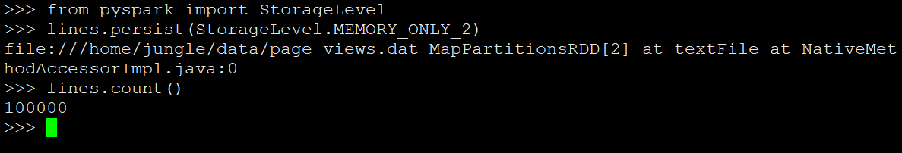

  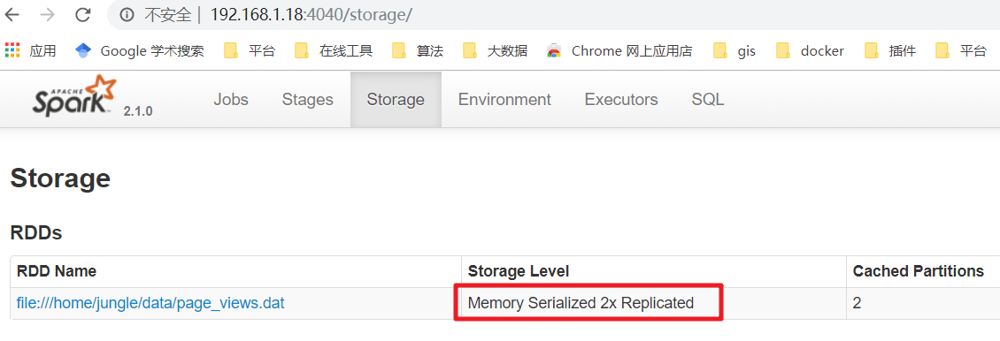

### 4.缓存策略选择依据

[网址](http://spark.apache.org/docs/latest/rdd-programming-guide.html#which-storage-level-to-choose)

- If your RDDs fit comfortably with the default storage level (`MEMORY_ONLY`), leave them that way. This is the most CPU-efficient option, allowing operations on the RDDs to run as fast as possible.
- If not, try using `MEMORY_ONLY_SER` and [selecting a fast serialization library](http://spark.apache.org/docs/latest/tuning.html) to make the objects much more space-efficient, but still reasonably fast to access. (Java and Scala)
- Don’t spill to disk unless the functions that computed your datasets are expensive, or they filter a large amount of the data. Otherwise, recomputing a partition may be as fast as reading it from disk.
- Use the replicated storage levels if you want fast fault recovery (e.g. if using Spark to serve requests from a web application). *All* the storage levels provide full fault tolerance by recomputing lost data, but the replicated ones let you continue running tasks on the RDD without waiting to recompute a lost partition.

## 五、Spark Lineage机制

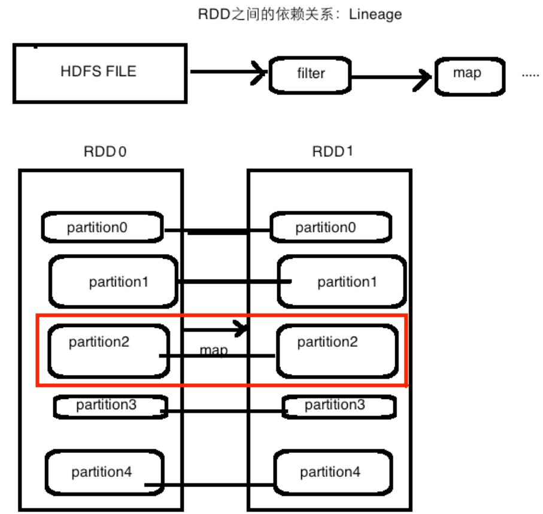

## 六、Spark窄依赖和宽依赖

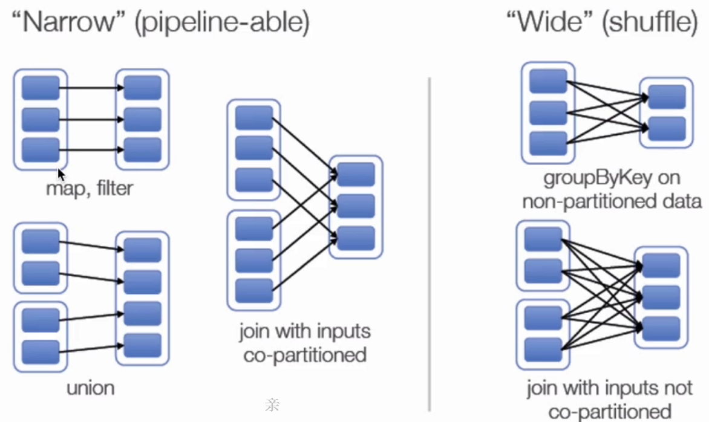


```
窄依赖：一个父RDD的partition之多被子RDD的某个partition使用一次	

宽依赖：一个父RDD的partition会被子RDD的partition使用多次，有shuffle
```

## 七、Spark Shuffle概述

[网址](http://spark.apache.org/docs/latest/rdd-programming-guide.html#shuffle-operations)

Certain operations within Spark trigger an event known as the shuffle. The shuffle is Spark’s mechanism for re-distributing data so that it’s grouped differently across partitions. This typically involves copying data across executors and machines, making the shuffle a complex and costly operation.

Operations which can cause a shuffle include **repartition** operations like [`repartition`](http://spark.apache.org/docs/latest/rdd-programming-guide.html#RepartitionLink) and [`coalesce`](http://spark.apache.org/docs/latest/rdd-programming-guide.html#CoalesceLink), **‘ByKey** operations (except for counting) like [`groupByKey`](http://spark.apache.org/docs/latest/rdd-programming-guide.html#GroupByLink) and [`reduceByKey`](http://spark.apache.org/docs/latest/rdd-programming-guide.html#ReduceByLink), and **join** operations like [`cogroup`](http://spark.apache.org/docs/latest/rdd-programming-guide.html#CogroupLink) and [`join`](http://spark.apache.org/docs/latest/rdd-programming-guide.html#JoinLink).

## 八、图解RDD的shuffle以及依赖关系

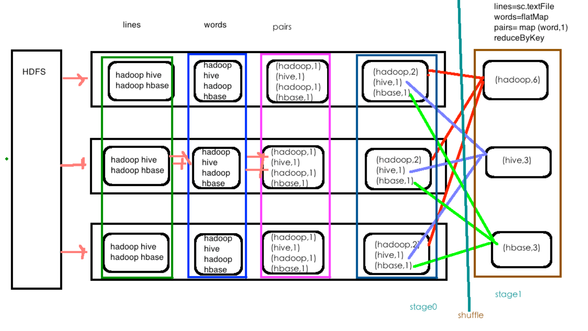

==测试==

```
sc.textFile("file:///home/jungle/data/hello.txt").flatMap(lambda line: line.split("\t")).map(lambda x: (x, 1)).reduceByKey(lambda a, b: a + b).collect()
```

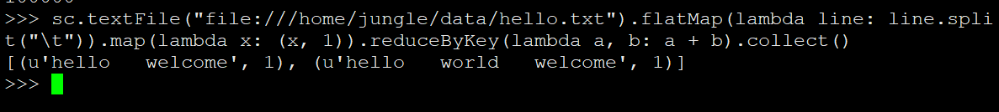

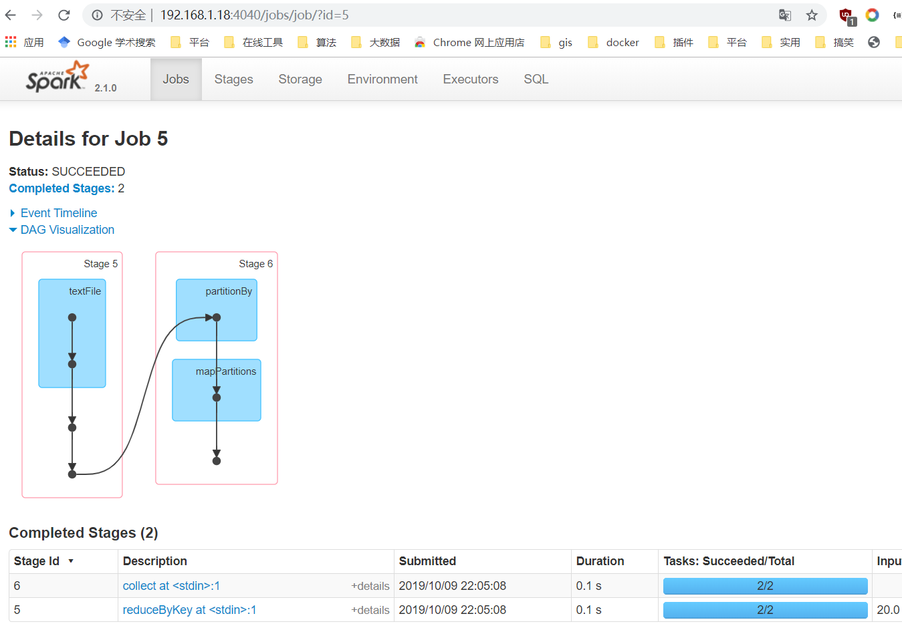


# 第7章 Spark Core调优

## 一、优化之HistoryServer配置及使用

[参考网址](http://spark.apache.org/docs/latest/monitoring.html)

```
spark-submit --master local[2] --name spark0301 /home/jungle/script/spark0301.py 
```


+ 设置

  ```
  cd $SPARK_HOME/conf
  vi spark-defaults.conf
  ```

  ```
  spark.eventLog.enabled           true                                
  spark.eventLog.dir               hdfs://centosserver1:8020/directory 
  ```

  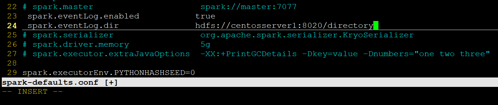

  ```
  vi spark-env.sh
  ```

  ```
  SPARK_HISTORY_OPTS="-Dspark.history.fs.logDirectory=hdfs://centosserver1:8020/directory "
  ```

  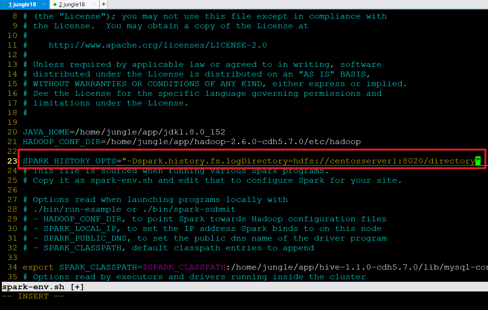

  ```
  hadoop fs -mkdir /directory
  ```

  

+ 启动

  ```
  cd $SPARK_HOME/sbin
  ./start-history-server.sh
  ```

+ 访问

  ```
  http://192.168.1.18:18080
  ```

  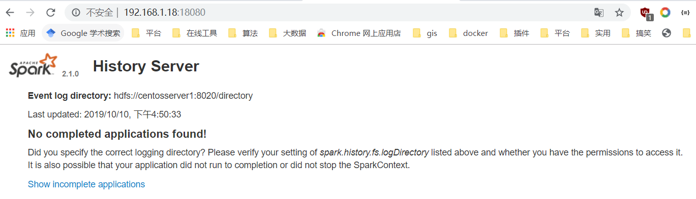

+ 测试

```
spark-submit --master local[2] --name spark0301 /home/jungle/script/spark0301.py 
```

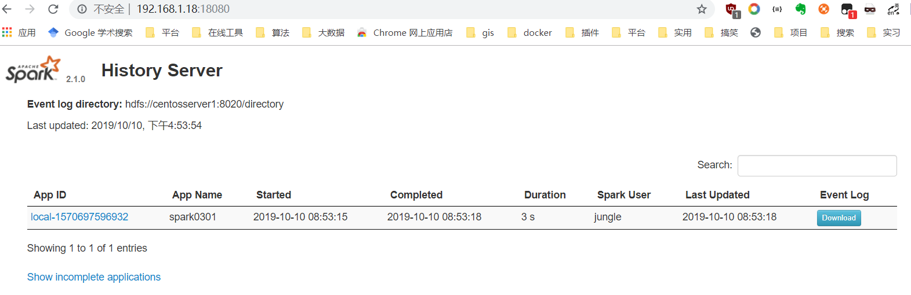

+ 关闭

  ```
  cd $SPARK_HOME/sbin
  ./stop-history-server.sh
  ```

  

## 二、优化之序列化

[参考网址](http://spark.apache.org/docs/latest/tuning.html#data-serialization)

Serialization plays an important role in the performance of any distributed application. Formats that are slow to serialize objects into, or consume a large number of bytes, will greatly slow down the computation. Often, this will be the first thing you should tune to optimize a Spark application. Spark aims to strike a balance between convenience (allowing you to work with any Java type in your operations) and performance. It provides two serialization libraries:

- [Java serialization](https://docs.oracle.com/javase/8/docs/api/java/io/Serializable.html): By default, Spark serializes objects using Java’s `ObjectOutputStream` framework, and can work with any class you create that implements [`java.io.Serializable`](https://docs.oracle.com/javase/8/docs/api/java/io/Serializable.html). You can also control the performance of your serialization more closely by extending [`java.io.Externalizable`](https://docs.oracle.com/javase/8/docs/api/java/io/Externalizable.html). Java serialization is flexible but often quite slow, and leads to large serialized formats for many classes.
- [Kryo serialization](https://github.com/EsotericSoftware/kryo): Spark can also use the Kryo library (version 4) to serialize objects more quickly. Kryo is significantly faster and more compact than Java serialization (often as much as 10x), but does not support all `Serializable` types and requires you to *register* the classes you’ll use in the program in advance for best performance.

## 三、优化之内存管理

[参考网址1](http://spark.apache.org/docs/latest/tuning.html#memory-management-overview)

[参考网址2](http://spark.apache.org/docs/latest/tuning.html#determining-memory-consumption)

[参考网址3](http://spark.apache.org/docs/latest/tuning.html#serialized-rdd-storage)

Although there are two relevant configurations, the typical user should not need to adjust them as the default values are applicable to most workloads:

- `spark.memory.fraction` expresses the size of `M` as a fraction of the (JVM heap space - 300MB) (default 0.6). The rest of the space (40%) is reserved for user data structures, internal metadata in Spark, and safeguarding against OOM errors in the case of sparse and unusually large records.
- `spark.memory.storageFraction` expresses the size of `R` as a fraction of `M` (default 0.5). `R` is the storage space within `M` where cached blocks immune to being evicted by execution.

---

The best way to size the amount of memory consumption a dataset will require is to create an RDD, put it into cache, and look at the “Storage” page in the web UI. The page will tell you how much memory the RDD is occupying.

To estimate the memory consumption of a particular object, use `SizeEstimator`’s `estimate` method. This is useful for experimenting with different data layouts to trim memory usage, as well as determining the amount of space a broadcast variable will occupy on each executor heap.

----

When your objects are still too large to efficiently store despite this tuning, a much simpler way to reduce memory usage is to store them in *serialized* form, using the serialized StorageLevels in the [RDD persistence API](http://spark.apache.org/docs/latest/rdd-programming-guide.html#rdd-persistence), such as `MEMORY_ONLY_SER`. Spark will then store each RDD partition as one large byte array. The only downside of storing data in serialized form is slower access times, due to having to deserialize each object on the fly. We highly recommend [using Kryo](http://spark.apache.org/docs/latest/tuning.html#data-serialization) if you want to cache data in serialized form, as it leads to much smaller sizes than Java serialization (and certainly than raw Java objects).

## 四、优化之广播变量

[网址](http://spark.apache.org/docs/latest/tuning.html#broadcasting-large-variables)

Using the [broadcast functionality](http://spark.apache.org/docs/latest/rdd-programming-guide.html#broadcast-variables) available in `SparkContext` can greatly reduce the size of each serialized task, and the cost of launching a job over a cluster. If your tasks use any large object from the driver program inside of them (e.g. a static lookup table), consider turning it into a broadcast variable. Spark prints the serialized size of each task on the master, so you can look at that to decide whether your tasks are too large; in general tasks larger than about 20 KB are probably worth optimizing.

## 五、优化之数据本地性

[网址](http://spark.apache.org/docs/latest/tuning.html#data-locality)

Data locality can have a major impact on the performance of Spark jobs. If data and the code that operates on it are together then computation tends to be fast. But if code and data are separated, one must move to the other. Typically it is faster to ship serialized code from place to place than a chunk of data because code size is much smaller than data. Spark builds its scheduling around this general principle of data locality.

Data locality is how close data is to the code processing it. There are several levels of locality based on the data’s current location. In order from closest to farthest:

- `PROCESS_LOCAL` data is in the same JVM as the running code. This is the best locality possible
- `NODE_LOCAL` data is on the same node. Examples might be in HDFS on the same node, or in another executor on the same node. This is a little slower than `PROCESS_LOCAL` because the data has to travel between processes
- `NO_PREF` data is accessed equally quickly from anywhere and has no locality preference
- `RACK_LOCAL` data is on the same rack of servers. Data is on a different server on the same rack so needs to be sent over the network, typically through a single switch
- `ANY` data is elsewhere on the network and not in the same rack


# 第8章 Spark SQL

## 一、Spark SQL前世今生

```
Spark SQL
	SQL:  MySQL、Oracle、DB2、SQLServer
	很多小伙伴熟悉SQL语言
	数据量越来越大 ==> 大数据(Hive、Spark Core)
	直接使用SQL语句来对大数据进行分析：这是大家所追逐的梦想

	person.txt ==> 存放在HDFS
	1,zhangsan,30
	2,lisi,31
	3,wangwu,32

	hive表：person
		id:int   name:string  age:int
	导入数据：
		load .....
	统计分析：
		select ... from person	

SQL on Hadoop
	Hive
	Shark 
	Impala: Cloudera
	Presto
	Drill
	.....

Hive: on MapReduce
	SQL ==> MapReduce ==> Hadoop Cluster

Shark: on Spark
	基于Hive源码进行改造

Spark SQL: on Spark


Hive on Spark

共同点： metastore  mysql

```

## 二、Spark SQL概述&错误认识纠正

[参考网址1](http://spark.apache.org/sql/)

[参考网址2](http://spark.apache.org/docs/latest/sql-programming-guide.html)

```
Spark SQL不仅仅是SQL这么简单的事情，它还能做更多的事情
	Hive: SQL
	Spark SQL: SQL

Spark SQL提供的操作数据的方式
	SQL
	DataFrame API
	Dataset API

一个用于处理结构化数据的Spark组件，强调的是“结构化数据”，而非“SQL”
```

## 三、Spark SQL架构

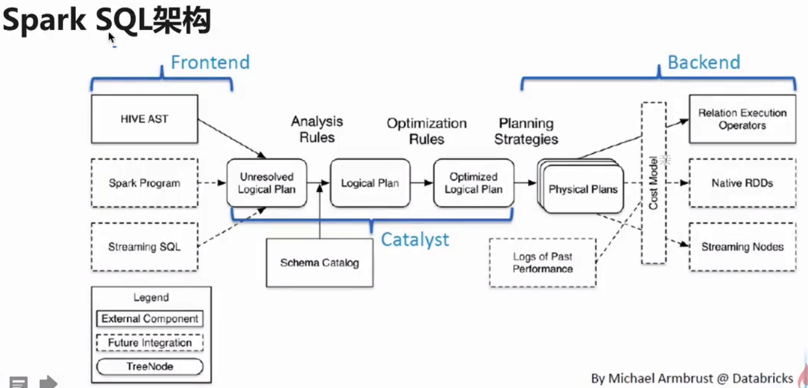

## 四、DataFrame&Dataset详解

[网址](http://spark.apache.org/docs/latest/sql-programming-guide.html#datasets-and-dataframes)

```
Spark RDD  VS  MapReduce
R/Pandas :  one machine  
	==> DataFrame：让小伙伴们感觉像开发单机版应用程序一样来开发分布式应用程序


A DataFrame is a Dataset organized into named columns
以列(列名、列类型、列值)的形式构成分布式的数据集

面试题：RDD与DataFrame的区别 12345
```

## 五、DataFrame API编程

[参考网址](http://spark.apache.org/docs/latest/sql-getting-started.html#getting-started)

--spark0801

```python
from pyspark.sql import SparkSession


def basic(spark):
    df = spark.read.json("file:///E:/data/people.json")
    df.show()
    df.printSchema()
    df.select("name").show()

if __name__ == '__main__':
    spark = SparkSession.builder.appName("spark0801").getOrCreate()

    basic(spark)
    spark.stop()
```


```
pyspark
```

```
df = spark.read.json("file:///home/jungle/app/spark-2.1.0-bin-2.6.0-cdh5.7.0/examples/src/main/resources/people.json")
df.show()
```

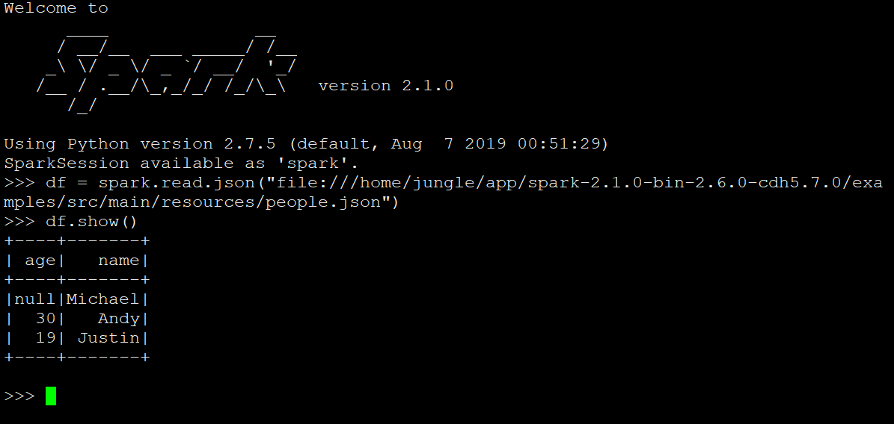

```
df.printSchema()
```

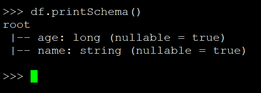

```
df.select("name").show()
```

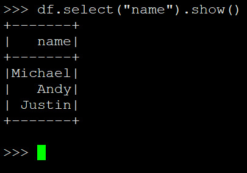

```
df.select(df['name'], df['age'] + 1).show()
```


```
df.createOrReplaceTempView("people")
sqlDF = spark.sql("SELECT * FROM people")
sqlDF.show()
```

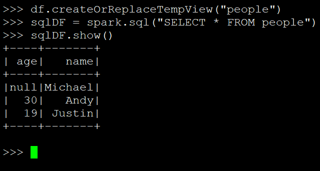

## 六、RDD与DataFrame互操作

[网址](http://spark.apache.org/docs/latest/sql-getting-started.html#interoperating-with-rdds)

### 1.方法一

 Inferring the Schema Using Reflection

```
lines = sc.textFile("file:///home/jungle/app/spark-2.1.0-bin-2.6.0-cdh5.7.0/examples/src/main/resources/people.txt")
parts = lines.map(lambda l: l.split(","))
people = parts.map(lambda p: Row(name=p[0], age=int(p[1])))
```

```
# 导包
from pyspark import Row
# 转成dataframe
schemaPeople = spark.createDataFrame(people)
# 转成表
schemaPeople.createOrReplaceTempView("people")
```

```
teenagers = spark.sql("SELECT name FROM people WHERE age >= 13 AND age <= 19")
teenagers.show()
```

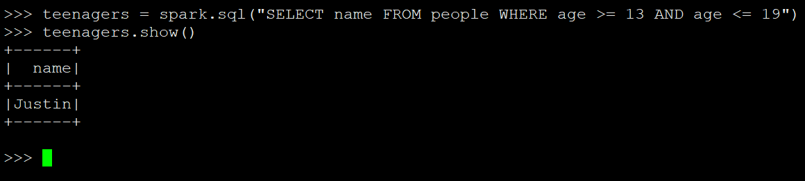

```
# dataframe转rdd
teenNames = teenagers.rdd.map(lambda p: "Name: " + p.name).collect()
```

--spark0801.py

```python
def schema_inference_example(spark):
    sc = spark.sparkContext

    # Load a text file and convert each line to a Row.
    lines = sc.textFile("file:///home/jungle/app/spark-2.1.0-bin-2.6.0-cdh5.7.0/examples/src/main/resources/people.txt")
    parts = lines.map(lambda l: l.split(","))
    people = parts.map(lambda p: Row(name=p[0], age=int(p[1])))

    # Infer the schema, and register the DataFrame as a table.
    schemaPeople = spark.createDataFrame(people)
    schemaPeople.createOrReplaceTempView("people")

    # SQL can be run over DataFrames that have been registered as a table.
    teenagers = spark.sql("SELECT name FROM people WHERE age >= 13 AND age <= 19")

    # The results of SQL queries are Dataframe objects.
    # rdd returns the content as an :class:`pyspark.RDD` of :class:`Row`.
    teenNames = teenagers.rdd.map(lambda p: "Name: " + p.name).collect()
    for name in teenNames:
        print(name)
```


### 2.方法二

 Programmatically Specifying the Schema

--spark0801

```python
def programmatic_schema_example(spark):
    sc = spark.sparkContext

    # Load a text file and convert each line to a Row.
    lines = sc.textFile("file:///home/jungle/app/spark-2.1.0-bin-2.6.0-cdh5.7.0/examples/src/main/resources/people.txt")
    parts = lines.map(lambda l: l.split(","))
    # Each line is converted to a tuple.
    people = parts.map(lambda p: (p[0], p[1].strip()))

    # The schema is encoded in a string.
    schemaString = "name age"

    fields = [StructField(field_name, StringType(), True) for field_name in schemaString.split()]
    schema = StructType(fields)

    # Apply the schema to the RDD.
    schemaPeople = spark.createDataFrame(people, schema)

    # Creates a temporary view using the DataFrame
    schemaPeople.createOrReplaceTempView("people")

    # SQL can be run over DataFrames that have been registered as a table.
    results = spark.sql("SELECT name FROM people")

    results.show()
```

# 第9章 Spark Streaming

## 一、 从词频统计案例来了解SparkStreaming 

 

```
Spark Streaming 
	is an extension of the core Spark API 
	enables scalable, high-throughput, fault-tolerant 
	stream processing of live data streams

流： Java SE  IO
	输入: 山沟沟、下水道...    Kafka, Flume, Kinesis, or TCP sockets
	// TODO...  业务逻辑处理
	输出: 痛、瓶子....   filesystems, databases, and live dashboards


常用实时流处理框架对比
	Storm：真正的实时流处理  Tuple   Java
	Spark Streaming：并不是真正的实时流处理，而是一个mini batch操作
		Scala、Java、Python  使用Spark一栈式解决问题
	Flink
	Kafka Stream
	
Spark Streaming它的职责所在 
	receives live input data streams
	divides the data into batches
	batches are then processed by the Spark engine 
	to generate the final stream of results in batches.


Spark Core的核心抽象叫做：RDD  5大特性、对应源码中的5个方法是什么
Spark Streaming的核心抽象叫做：DStream
	represents a continuous stream of data
	DStreams can be created either from input data streams from sources such as Kafka, Flume, and Kinesis
	or by applying high-level operations on other DStreams. 
	Internally, a DStream is represented as a sequence of RDDs.

```

 

 

==服务器上运行==

```
nc -lk 9999
```

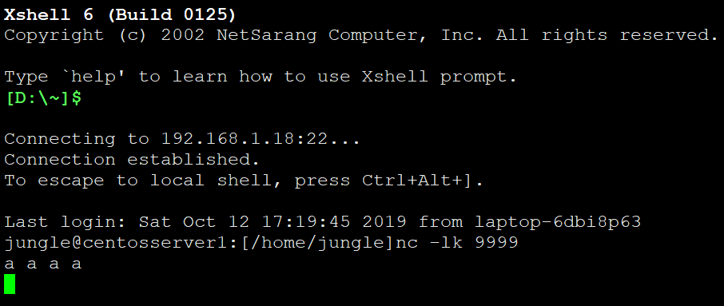

```
cd $SPARK_HOME
spark-submit examples/src/main/python/streaming/network_wordcount.py localhost 9999
```

> ui:192.168.1.18:4040

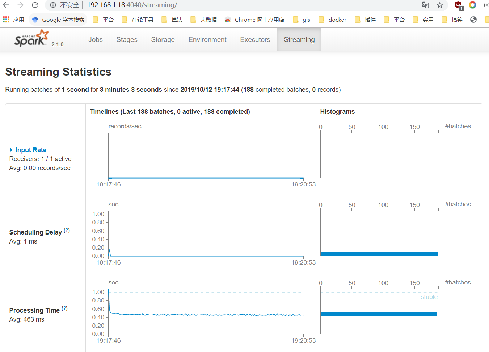


## 二、 核心概念之StreamingContext 

[参考网址](http://spark.apache.org/docs/latest/streaming-programming-guide.html#initializing-streamingcontext)

--spark0901

```python
import sys

from pyspark import SparkContext
from pyspark.streaming import StreamingContext

if __name__ == '__main__':

    if len(sys.argv) != 3:
        print("Usage: spark0901.py <hostname> <port>", file=sys.stderr)
        sys.exit(-1)


    sc = SparkContext(appName="spark0901")
    ssc = StreamingContext(sc, 5)

    # TODO... 根据业务需求开发我们自己的业务

    # Define the input sources by creating input DStreams.
    lines = ssc.socketTextStream(sys.argv[1], int(sys.argv[2]))

    # Define the streaming computations by applying transformation
    counts = lines.flatMap(lambda line:line.split(" "))\
        .map(lambda word:(word,1))\
        .reduceByKey(lambda a,b:a+b)

    # output operations to DStreams
    counts.pprint()

    # Start receiving data and processing it
    ssc.start()

    # Wait for the processing to be stopped
    ssc.awaitTermination()
```

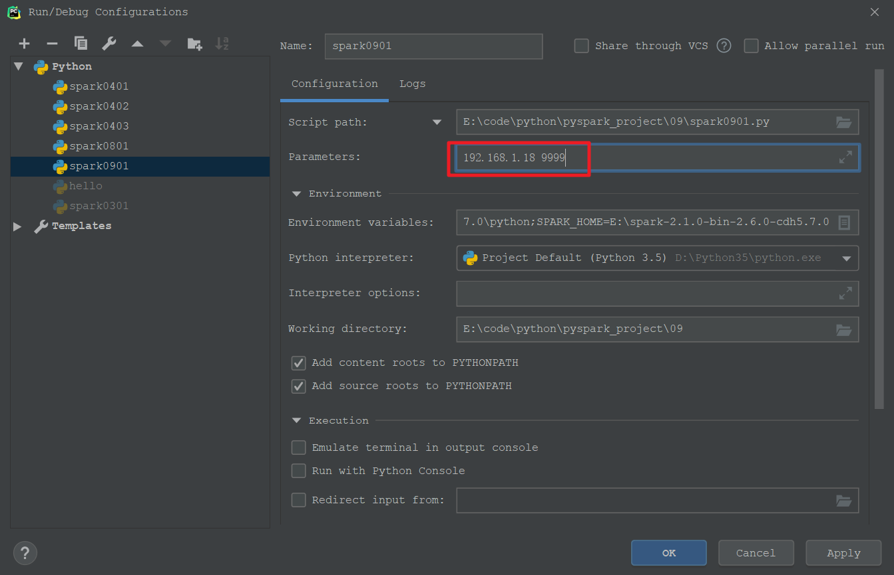

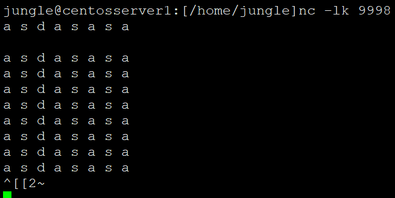

## 三、 DStream及常用操作 

[参考网址](http://spark.apache.org/docs/latest/streaming-programming-guide.html#discretized-streams-dstreams)

  

  

--spark0902

```python
import sys

from pyspark import SparkContext
from pyspark.streaming import StreamingContext

if __name__ == '__main__':

    if len(sys.argv) != 2:
        print("Usage spark0902.py <directory>", file=sys.stderr)
        sys.exit(-1)

    sc = SparkContext(appName="spark0902")

    # 时间间隔为5秒
    ssc = StreamingContext(sc, 5)

    lines = ssc.textFileStream(sys.argv[1])
    counts = lines.flatMap(lambda line:line.split(" "))\
        .map(lambda word:(word,1)).reduceByKey(lambda a,b:a+b)
    counts.pprint()

    ssc.start()
    ssc.awaitTermination()
```

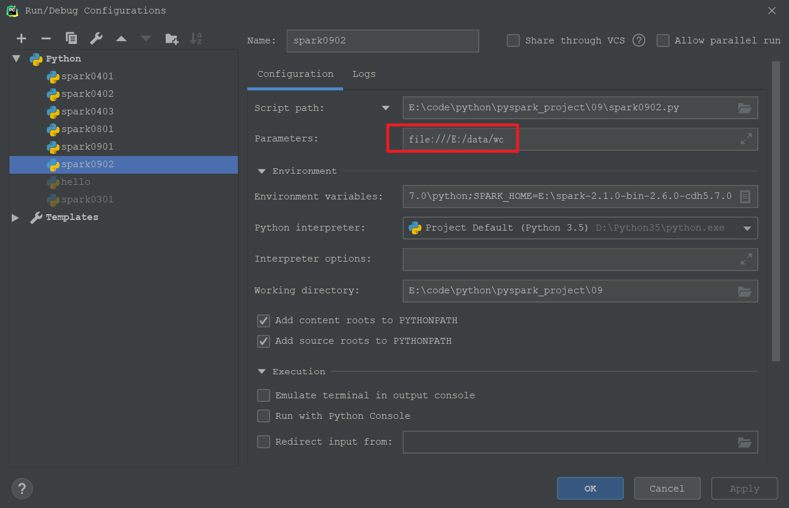


---

# 第10章 Azkaban基础篇

[参考网址]( https://azkaban.github.io/ )

## 一、 工作流概述 

```
工作流概述
	请假  OA
		1 ：部门经理审批
		3 ：部门经理审批 ==> HR
		5 ：部门经理审批 ==> HR ==> 老大
		10：.....
	借款： 涉及金额
```

## 二、 工作流在大数据处理中的重要性 


```
Spark SQL/Hadoop用于做离线统计处理
ETL
1) 数据抽取： 
	Sqoop把RDBMS中的数据抽取到Hadoop
	Flume进行日志、文本数据的采集，采集到Hadoop
2) 数据处理
	Hive/MapReduce/Spark/......
3) 统计结果入库
	数据就存放到HDFS(Hive/Spark SQL/文件)
		启动一个Server: HiveServer2 / ThriftServer
		jdbc的方式去访问统计结果
	使用Sqoop把结果导出到RDBMS中

这些作业之间是存在时间先后依赖关系的
Step A ==> Step B ==> Step C 

crontab定时调度
为了更好的组织起这样的复杂执行计算的关系===> 这就需要一个工作流调度系统来进行依赖关系作业的调度


Linux crontab + shell
	优点：简单、易用
	缺点：
		维护
		依赖
			step a:  01:30  30分钟
			step b:  02:10  30分钟
			step c:  02:50  30分钟
			.....
			资源利用率
			集群在0130压力非常大，资源没有申请到
```

## 三、 常用调度框架介绍 

```
常用的调度框架
	Azkaban：轻量级
	Oozie：重量级
		cm hue
		xml
	宙斯(Zeus)
```

## 四、 Azkaban概述及特性 

- Compatible with any version of Hadoop

- Easy to use web UI

- Simple web and http workflow uploads

- Project workspaces

- Scheduling of workflows

- Modular and pluginable

- Authentication and Authorization

- Tracking of user actions

- Email alerts on failure and successes

- SLA alerting and auto killing

- Retrying of failed jobs

  ```
  Azkaban概述
  	Open-source Workflow Manager
  	批处理工作流，用于跑Hadoop的job
  	提供了一个易于使用的用户界面来维护和跟踪你的工作流程
  ```


---

## 五、 Azkaban架构 

```
Azkaban架构
	Relational Database (MySQL)
	AzkabanWebServer
	AzkabanExecutorServer
```


## 六、 Azkaban运行模式详解 

[参考网址](https://azkaban.readthedocs.io/en/latest/getStarted.html#getting-started)

```
Azkaban运行模式
	solo-server
		数据信息存储在H2==>MySQL
		webserver和execserver是运行在同一个进程中
	the heavier weight two server mode
		数据信息存储在MySQL，在生产上一定要做主备 
		webserver和execserver是运行在不同的进程中的
	distributed multiple-executor mode
```

现在有两种方式：

 the stand alone “solo-server” mode and distributed multiple-executor mode.  

## 七、 Azkaban源码编译 

1. GitHub上找稳定版本的[Azkaban]( https://github.com/azkaban/azkaban/releases?after=3.62.0 )

   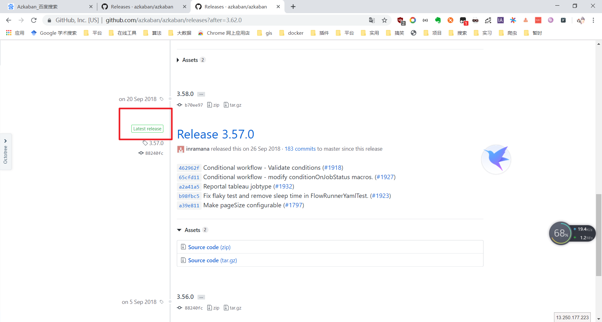

2. 下载

   ```
   Azkaban编译：万世开头难，务必要保证你的网络速度不错
   	1） 去github上下载源码包
   	2） ./gradlew build installDist
   	3） 建议搭建先去下载gradle-4.1-all.zip 然后整合到azkaban源码中来，避免在编译的过程中去网络上下载，导致编译速度非常慢
   	4） 编译成功之后，去对应的目录下找到对应模式的安装包即可
   ```

   

   + 3.40.0

   ```
   wget https://github.com/azkaban/azkaban/archive/3.40.0.tar.gz
   ```

   解压

   ```
   tar -zxvf 3.40.0.tar.gz -C ~/app/
   ```

   ```
   cd ~/app/azkaban-3.40.0/gradle/wrapper
   ```

   这边在Windows浏览器中下载

   ```
   wegt https://services.gradle.org/distributions/gradle-4.1-all.zip
   ```

   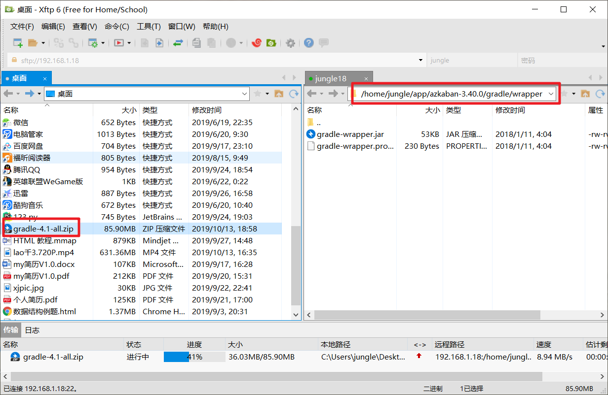

   

   ```
   vi gradle-wrapper.properties
   ```

   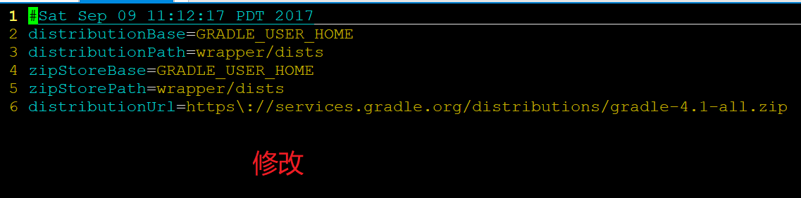

   ```
   distributionUrl=gradle-4.1-all.zip 
   ```

   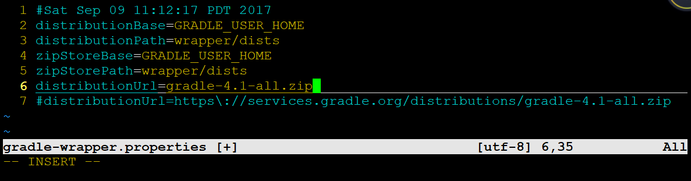

   ```
   cd ~/app/azkaban-3.40.0/
   ```

   ```
   ./gradlew build installDist
   ```

   + 3.57.0

     ```
     wget https://github.com/azkaban/azkaban/archive/3.57.0.tar.gz
     ```

     解压

     ```
     tar -zxvf 3.57.0.tar.gz -C ~/app/
     ```

      **修改邮件代码** 

     ```
     vi /azkaban-3.57.0/azkaban-common/src/main/java/azkaban/utils/EmailMessage.java
     ```

      找到邮件参数配置的地方 

     ```
     :/props
     ```

      增加以下语句： 

     ```
     props.put("mail.smtp.socketFactory.class", "javax.net.ssl.SSLSocketFactory");
     ```

      **[安装JCE]( https://blog.csdn.net/andyguan01_2/article/details/88343641 )** 

     安装JCE步骤：

     1、打开以下网址，下载JCE压缩包：
     http://www.oracle.com/technetwork/java/javase/downloads/jce8-download-2133166.html

       

     压缩包里有以下文件：

       

     2、将压缩包解压，local_policy.jar和US_export_policy.jar这两个jar包放到$JAVA_HOME/jre/lib/security目录。因为目录下已有这两个文件，可以先备份，再覆盖。

     ```
     mv $JAVA_HOME/jre/lib/security/local_policy.jar $JAVA_HOME/jre/lib/security/local_policy.jar.bak
     mv $JAVA_HOME/jre/lib/security/US_export_policy.jar $JAVA_HOME/jre/lib/security/US_export_policy.jar.bak
     cp local_policy.jar US_export_policy.jar $JAVA_HOME/jre/lib/security
     ```

     **编译文件** 

   ```
   cd azkaban-3.57.0
   ./gradlew build installDist
   ```

   ==报错==

   ```
   > Task :azkaban-common:test
   
   azkaban.utils.UtilsTest > testValidCronExpressionV FAILED
       java.lang.AssertionError
           at org.junit.Assert.fail(Assert.java:86)
           at org.junit.Assert.assertTrue(Assert.java:41)EmailMessageCreatorTest
           at org.junit.Assert.assertTrue(Assert.java:52)
           at azkaban.utils.UtilsTest.testValidCronExpressionV(UtilsTest.java:63)
   ```

    于是改为使用命令./gradlew build installDist -x test，-x test表示跳过测试。 

   ```
   ./gradlew clean
   ./gradlew build installDist -x test
   ```

+  **复制可执行文件到安装目录** 

  ```
  cd app
  ll azkaban-3.57.0/azkaban-*/build/distributions/*.tar.gz
  cp azkaban-3.57.0/azkaban-*/build/distributions/*.tar.gz ~/software/azkaban-3.57.0
  cd
  ll software/azkaban-3.57.0
  ```

  

## 八、 Azkaban solo server环境部署

```
Azkaban环境搭建
	1) 解压编译后的安装包到~/app
	2）启动azkaban   $AZKABAN_HOME/bin/azkaban-solo-start.sh
		验证：jps  AzkabanSingleServer
		ip:8081(可以在azkaban.properties中修改)

```

---


```
cd /home/jungle/software/azkaban-3.57.0
```

```
tar -zvxf azkaban-solo-server-0.1.0-SNAPSHOT.tar.gz -C ~/app/
```

```
cd /home/jungle/app/azkaban-solo-server-0.1.0-SNAPSHOT/bin
```

```
./start-solo.sh
```

==报错==

> Cannot find 'database.properties' file

 解决方案是： 

```
cd conf
```

 在azkaban.properties中增加一个配置
database.sql.scripts.dir=/home/jungle/app/azkaban-solo-server-0.1.0-SNAPSHOT/sql
注意，这个配置不能写/home/jungle/app/azkaban-solo-server-0.1.0-SNAPSHOT/sql/azkaban.properties，只能写到 sql ，然后问题就不存在了。 

==报错==

> conf/global.properties (No such file or directory)

```
vi azkaban.properties
```

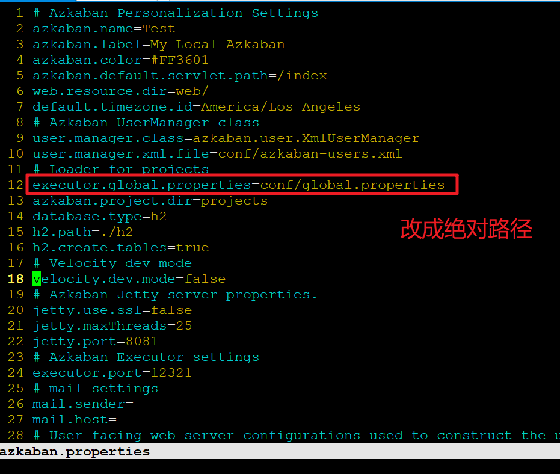

```
executor.global.properties=/home/jungle/app/azkaban-solo-server-0.1.0-SNAPSHOT/conf/global.properties
```

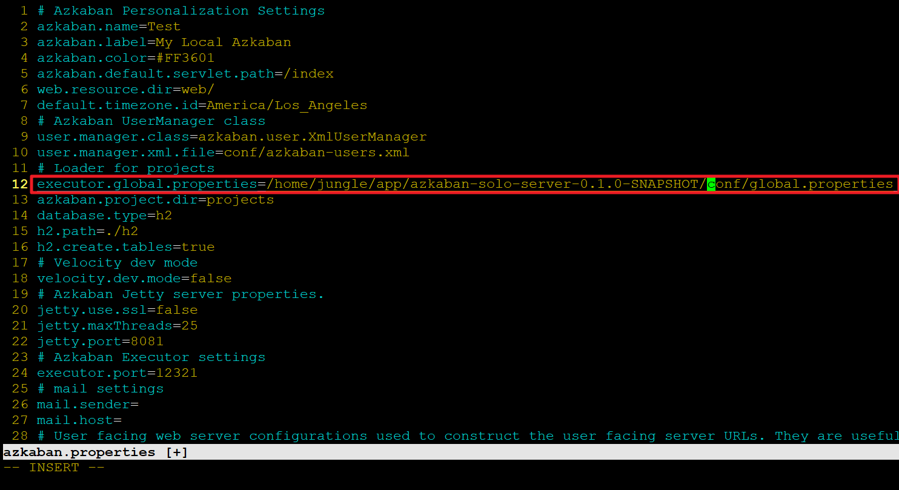

==报错==

> java.lang.RuntimeException: java.lang.reflect.InvocationTargetException

```
cd conf
vi azkaban.properties
```

    

```
jps
```

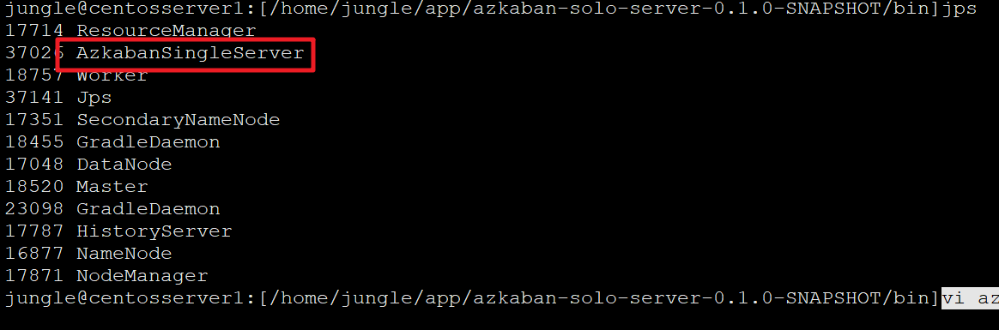

```
UI:http://192.168.1.18:9081/
```

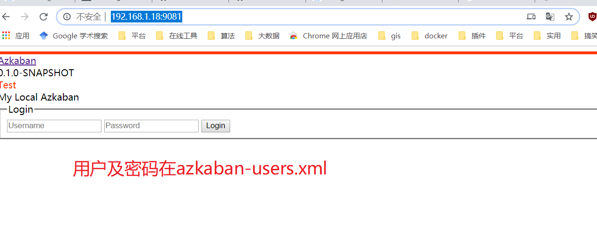

增加用户

```
vi azkaban-users.xml
```

```xml
<user password="123456" roles="admin" username="jungle"/>
```

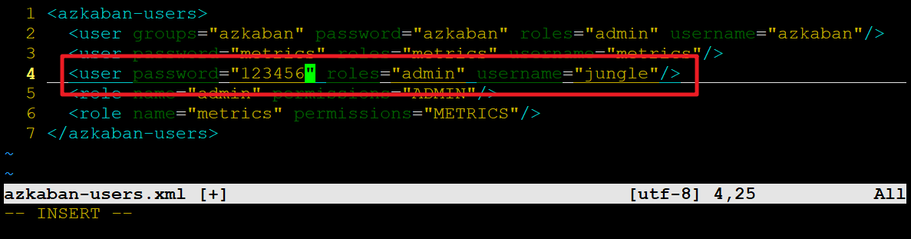

==注意==

实在不行，就参考[官网](https://azkaban.readthedocs.io/en/latest/getStarted.html#installing-the-solo-server)的做法

## 九、 Azkaban快速入门案例 

[参考网址](https://azkaban.readthedocs.io/en/latest/createFlows.html#creating-flows)

1. 创建工程

[参考网址](https://azkaban.readthedocs.io/en/latest/useAzkaban.html#create-projects)

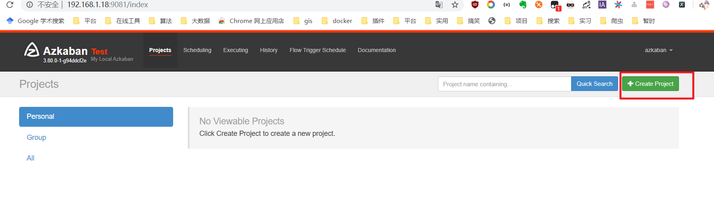

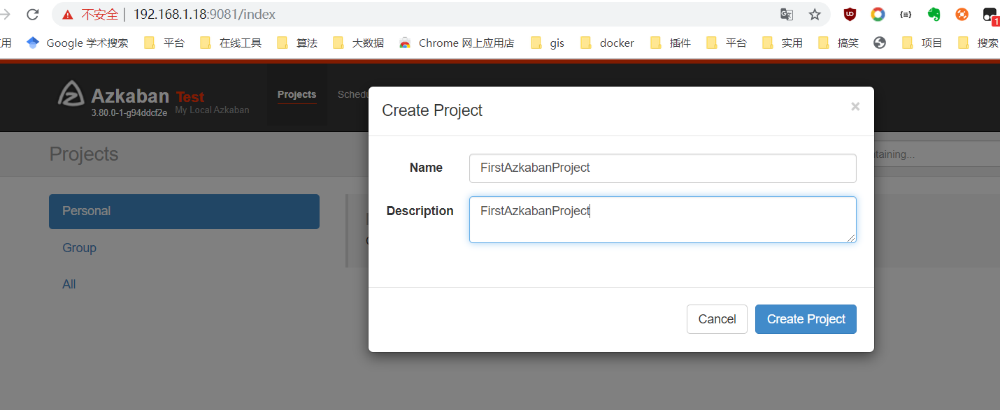

---

2. [创建流](https://azkaban.readthedocs.io/en/latest/createFlows.html#creating-flows)

   ### Step 1:

   Create a simple file called `flow20.project`. Add `azkaban-flow-version` to indicate this is a Flow 2.0 Azkaban project:

   ```
   azkaban-flow-version: 2.0
   ```

   ### Step 2:

   Create another file called `basic.flow`. Add a section called `nodes`, which will contain all the jobs you want to run. You need to specify `name` and `type` for all the jobs. Most jobs will require the `config` section as well. We will talk more about it later. Below is a simple example of a command job.

   ```
   nodes:
     - name: jobA
       type: command
       config:
         command: echo "This is an echoed text."
   ```

   ### Step 3:

   Select the two files you’ve already created and right click to compress them into a zip file called `Archive.zip`. You can also create a new directory with these two files and then `cd` into the new directory and compress: `zip -r Archive.zip .` Please do not zip the new directory directly.

   Make sure you have already created a project on Azkaban ( See [Create Projects](https://azkaban.readthedocs.io/en/latest/useAzkaban.html#createprojects) ). You can then upload Archive.zip to your project through Web UI ( See [Upload Projects](https://azkaban.readthedocs.io/en/latest/useAzkaban.html#uploadprojects) ).

   Now you can click `Execute Flow` to test your first Flow 2.0 Azkaban project!

3. [上传流](https://azkaban.readthedocs.io/en/latest/useAzkaban.html#upload-projects)

   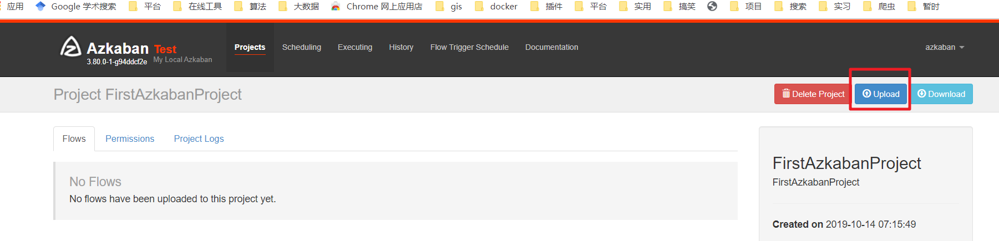

Click on the **Upload** button. You will see the following dialog.

 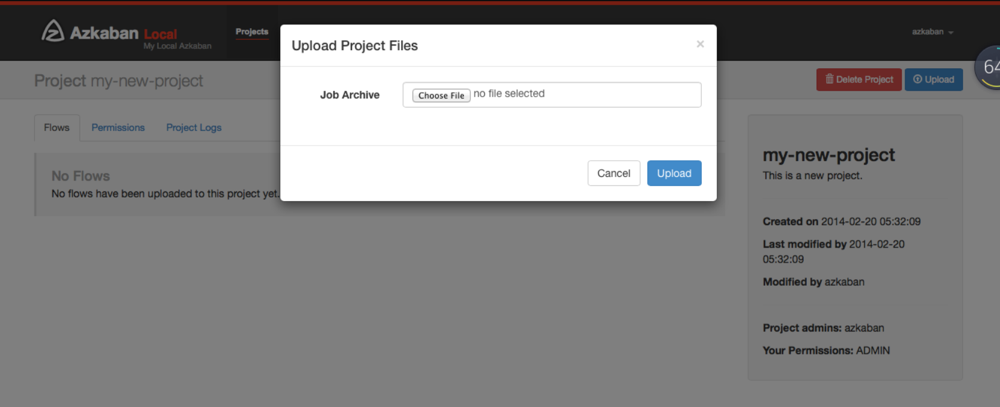

Azkaban will validate the contents of the zip to make sure that dependencies are met and that there’s no cyclical dependencies detected. If it finds any invalid flows, the upload will fail.

Uploads overwrite all files in the project. Any changes made to jobs will be wiped out after a new zip file is uploaded.

After a successful upload, you should see all of your flows listed on the screen.

# 第11章 Azkaban实战篇

##  一、依赖作业在Azkaban中的使用 

[参考网址](https://azkaban.readthedocs.io/en/latest/createFlows.html#job-dependencies)

Jobs can have dependencies on each other. You can use `dependsOn` section to list all the parent jobs. In the below example, after jobA and jobB run successfully, jobC will start to run.

```
nodes:
  - name: jobC
    type: noop
    # jobC depends on jobA and jobB
    dependsOn:
      - jobA
      - jobB

  - name: jobA
    type: command
    config:
      command: echo "This is an echoed text."

  - name: jobB
    type: command
    config:
      command: pwd
```

You can zip the new `basic.flow` and `flow20.project` again and then upload to Azkaban. Try to execute the flow and see the difference.

1. 新建项目

   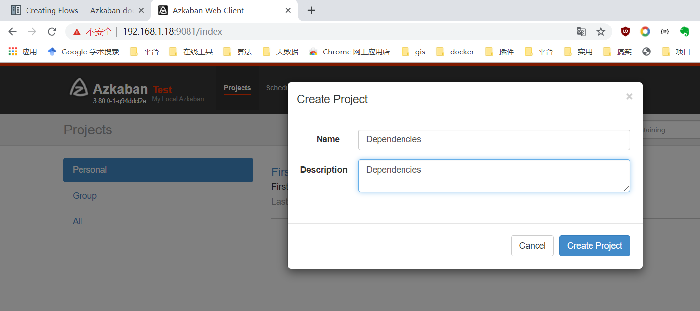

2. 上传zip包

   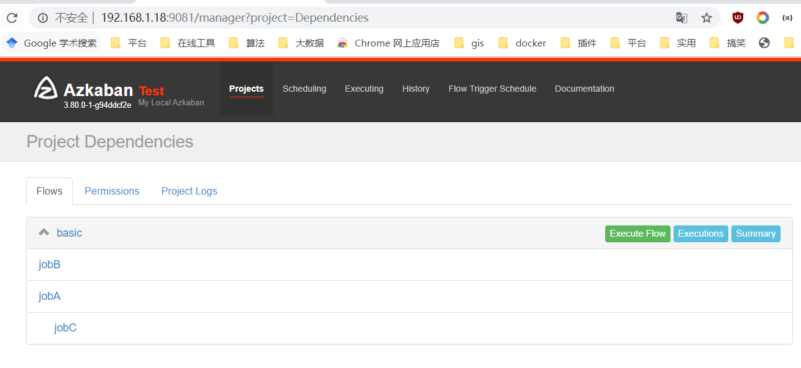

## 二、 HDFS作业在Azkaban中的使用 

```
hadoop fs -mkdir /azkaban1
hadoop fs -mkdir /azkaban2
hadoop fs -ls /
```

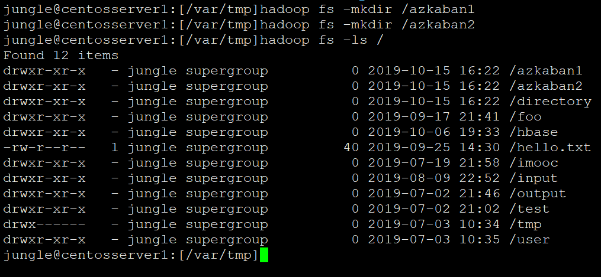

1. job

   --hadoop.flow

   ```
   nodes:
     - name: jobA
       type: command
       # jobC depends on jobA and jobB
       config:
         command: /home/jungle/app/hadoop-2.6.0-cdh5.7.0/bin/hadoop fs -ls /
   
   ```

2. 新建项目

   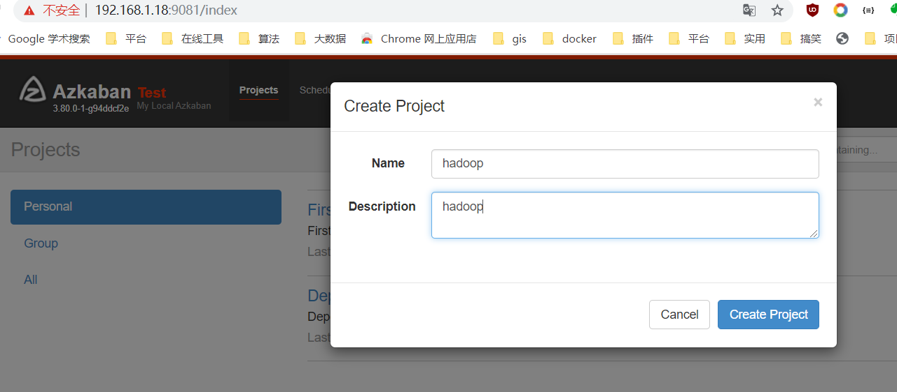

3. 上传zip包

   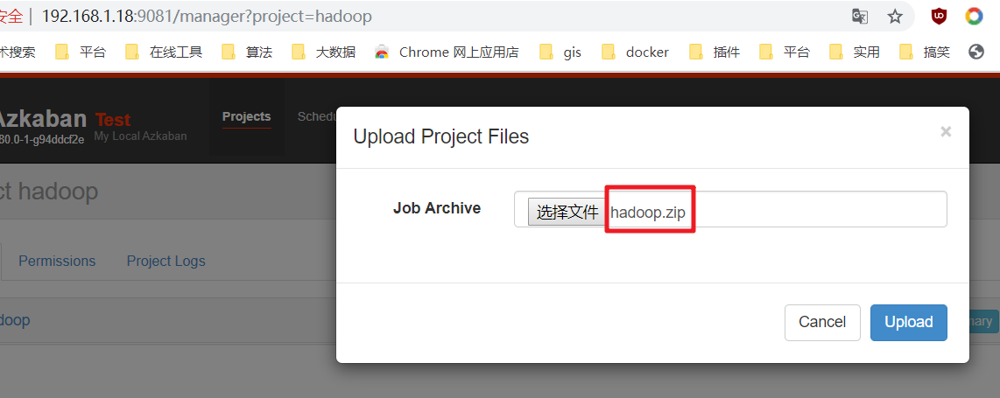

4. 运行结果

   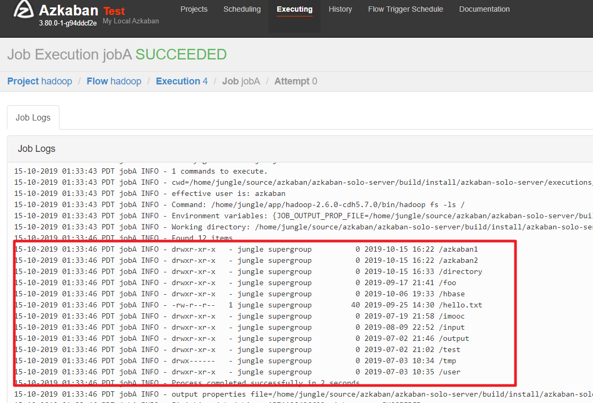

## 三、 MapReduce作业在Azkaban中的使用 

--mr_pi.flow

```
nodes:
  - name: jobA
    type: command
    config:
      command: hadoop jar /home/jungle/app/hadoop-2.6.0-cdh5.7.0/share/hadoop/mapreduce/hadoop-mapreduce-examples-2.6.0-cdh5.7.0.jar pi 2 3

```

--mr_wc.flow

```
nodes:
  - name: jobA
    type: command
    config:
    # /hello.txt /az/wc是hdfs上的目录
      command: hadoop jar /home/jungle/app/hadoop-2.6.0-cdh5.7.0/share/hadoop/mapreduce/hadoop-mapreduce-examples-2.6.0-cdh5.7.0.jar wordcount /hello.txt /az/wc

```

==在线修改==

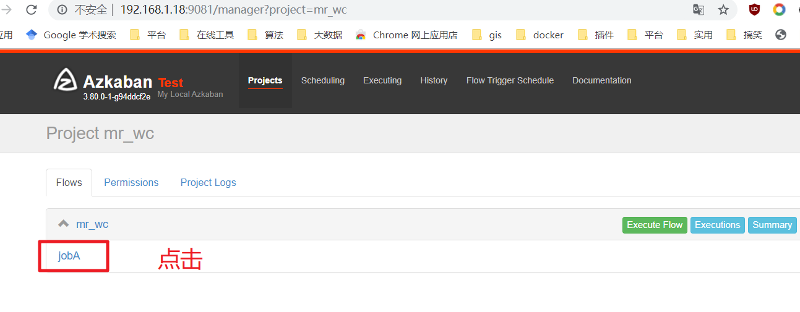

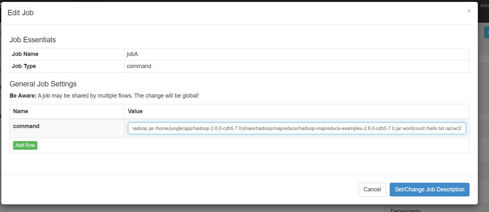

> 也可以通过web界面查看： http://192.168.1.18:8088/cluster 

## 四、 Hive作业在Azkaban中的使用 

1. 启动hive

   ```
   hive
   ```

   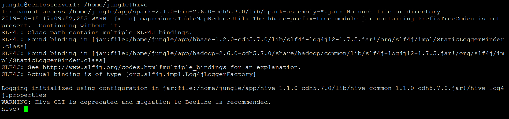

   ```
   create table emp(
   empno int, ename string, job string,
   mgr int, hiredate string, sal double,
   comm double, deptno int
   )row format delimited fields terminated by '\t';
   ```

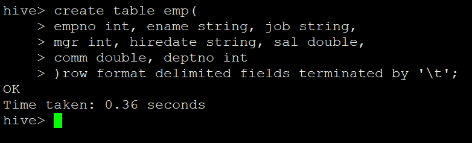

```
# 加载数据到表
load data local inpath '/home/jungle/data/emp.txt' overwrite into table emp
```


```
select * from emp;
```

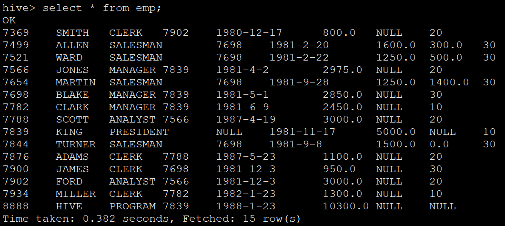

```
select deptno,count(1) from emp group by deptno;
```

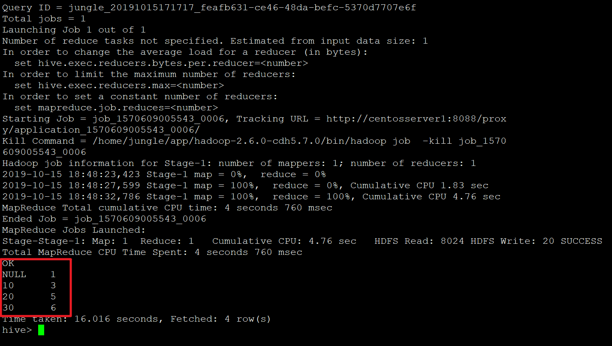

---

+ azkaban上执行hive指令

  ==方法一==
```
vi test.sql
```

```
select deptno,count(1) from emp group by deptno;
```

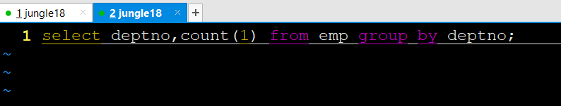

--hive.flow

```
nodes:
  - name: jobA
    type: command
    config:
      command: hive -f /home/jungle/sql/test.sql

```

==方法二==

--hive.flow

```
nodes:
  - name: jobA
    type: command
    config:
      command: hive -f "test.sql"
```

> 把test.sql也打入zip包

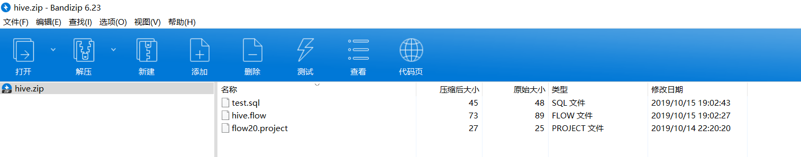


## 五、 定时调度作业在Azkaban中的使用 

### 1.启动定时任务


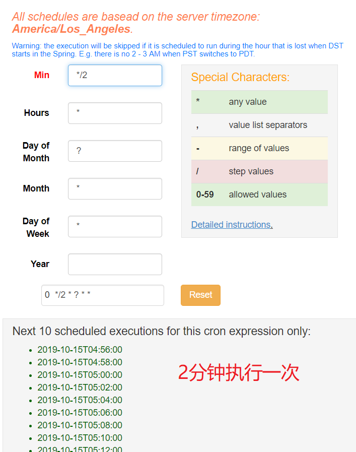

### 2.删除定时任务


## 六、 邮件告警及SLA在Azkaban中的使用 

[参考网址](https://azkaban.readthedocs.io/en/latest/useAzkaban.html#email-overrides)

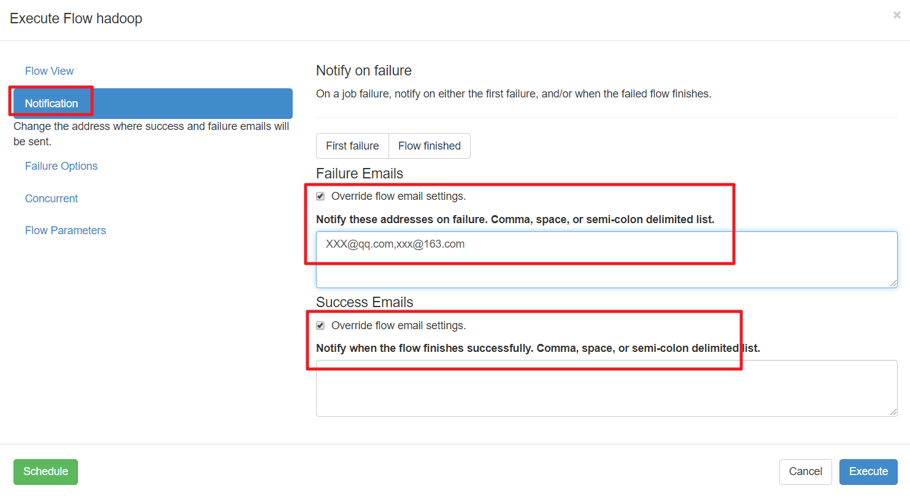

```
cd /home/jungle/source/azkaban/azkaban-solo-server/build/install/azkaban-solo-server/conf
```

```
vi azkaban.properties
```

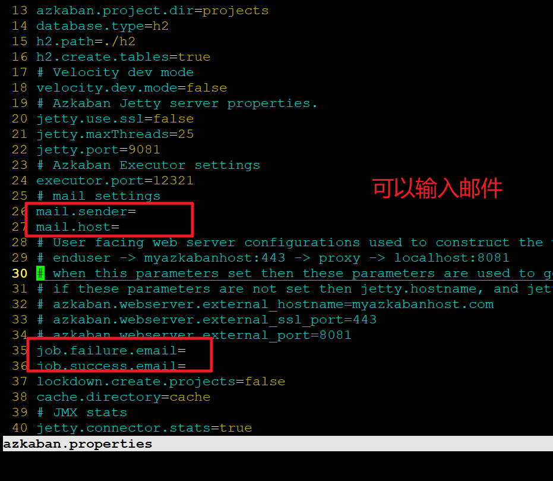

+ SLA

```
SLA：Service-Level Agreement的缩写，意思是服务等级协议。
SLA：某个作业必须要在某个时间范围内要执行完成
	互联网公司
	99.99% 
	99.999%
	99.9%
```

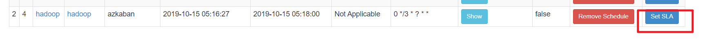

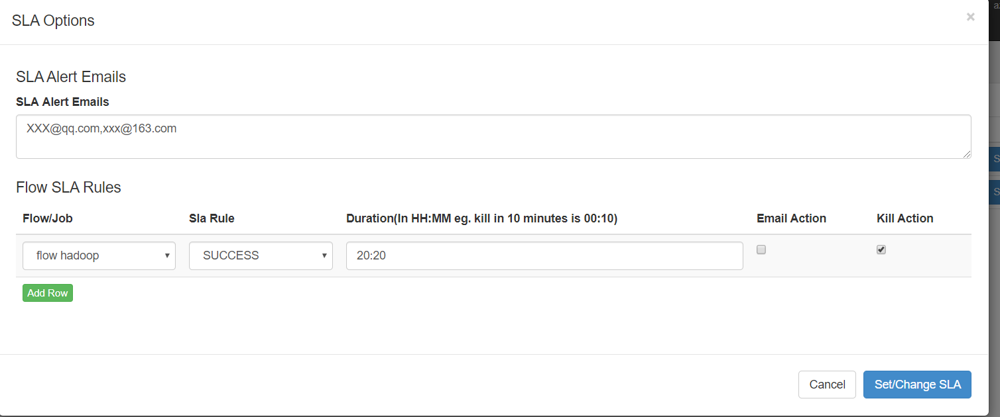

# 第12章 Azkaban进阶篇

##  一、Multi Executor Serve

[参考网址](https://azkaban.readthedocs.io/en/latest/getStarted.html#getting-started-with-the-multi-executor-server)

### 1.[Database setup](https://azkaban.readthedocs.io/en/latest/getStarted.html#database-setup)

```
# 进入mysql
mysql -uroot -p -h192.168.1.18 -P9906
```

```
# 建库
 CREATE DATABASE azkaban;
```

```
# 创建用户
 CREATE USER 'jungle'@'%' IDENTIFIED BY '123456';
```

```
# 为用户赋予权限
GRANT SELECT,INSERT,UPDATE,DELETE ON azkaban.* to 'jungle'@'%' WITH GRANT OPTION;
```

```
# 刷新权限
flush privileges;
```

+  Create the Azkaban Tables 

  ```
  cd /home/jungle/source/azkaban/azkaban-db/build/install/azkaban-db
  ll
  ```

  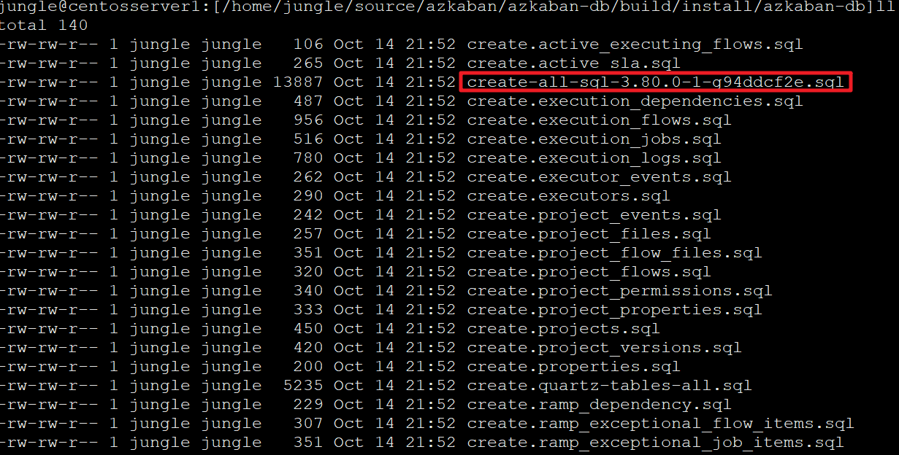

  数据库导入sql语句

  ```
  source /home/jungle/source/azkaban/azkaban-db/build/install/azkaban-db/create-all-sql-3.80.0-1-g94ddcf2e.sql
  ```

  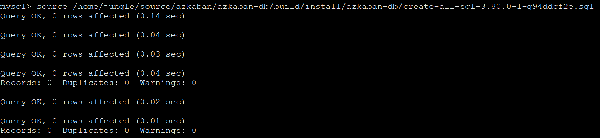

  ```
  show tables;
  ```

  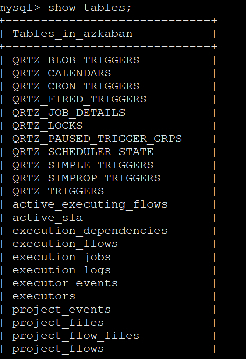

### 2.Installing Azkaban Executor Server

```
cd /home/jungle/source/azkaban/azkaban-exec-server/build/install/azkaban-exec-server/bin
```

```
vi executor.port
```

```
curl -G "localhost:39589/executor?action=activate" && echo
```

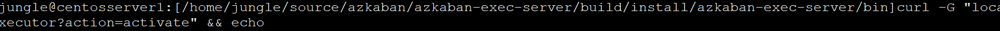

### 3. Azkaban Web Server

[参考网址](https://azkaban.readthedocs.io/en/latest/getStarted.html#installing-azkaban-web-server)

```
cd /home/jungle/source/azkaban/azkaban-web-server/build/install/azkaban-web-server/conf
```

```
vi azkaban.properties
```

```
azkaban.name=junglegodlion
azkaban.label=jungle Local Azkaban
default.timezone.id=Asia/Shanghai
mysql.user=jungle
mysql.password=123456
jetty.port=10081
```

启动

```
cd /home/jungle/source/azkaban/azkaban-web-server/build/install/azkaban-web-server/bin
./bin/start-web.sh
```

==查看日志位置==

```
vi start-web.sh
```

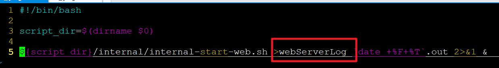

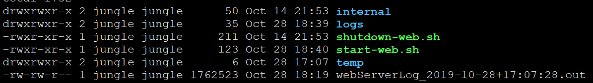

==或者==

```
vi /home/jungle/source/azkaban/azkaban-web-server/build/install/azkaban-web-server/bin/logs/azkaban-webserver.log
```

> 报错：Caused by: com.mysql.jdbc.exceptions.jdbc4.CommunicationsException: Communications link failure

==修正==

```
vi azkaban.properties
```

```
mysql.port=9906
```

> 报错：java.lang.RuntimeException: java.lang.reflect.InvocationTargetException

==修正==

```
cd conf
vi azkaban.properties
```

```
user.manager.xml.file=/home/jungle/source/azkaban/azkaban-web-server/build/install/azkaban-web-server/conf/azkaban-users.xml
```

----

万不得已的做法：

####   Azkaban 安装部署  

1. 准备

   a) azkaban-web-server-2.5.0.tar.gz
   b) azkaban-executor-server-2.5.0.tar.gz
   c) azkaban-sql-script-2.5.0.tar.gz

2.   安装 

   ```
   cd app
   mkdir azkaban
   ```

   ```
   cd software
   ```

   ```
   tar -zxvf azkaban-web-server-2.5.0.tar.gz -C ~/app/azkaban/
   tar -zxvf azkaban-executor-server-2.5.0.tar.gz -C ~/app/azkaban/
   tar -zxvf azkaban-sql-script-2.5.0.tar.gz -C ~/app/azkaban/
   ```

3.   对解压后的文件重新命名  

   ```
   cd azkaban
   mv azkaban-web-2.5.0/ server
   mv azkaban-executor-2.5.0/ executor
   ```

   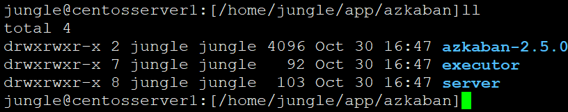


4. 进入 mysql， 创建 azkaban 数据库，并将解压的脚本导入到 azkaban 数据库。  

   ```
   mysql -uroot -p -h192.168.1.18 -P9906
   ```

   ```
   create database azkaban;
   use azkaban;
   source ~/app/azkaban/azkaban-2.5.0/create-all-sql-2.5.0.sql
   ```

5.    生成密钥对和证书  

    ```
    cd azkaban
    ```

    ```
    keytool -keystore keystore -alias jetty -genkey -keyalg RSA
    ```

    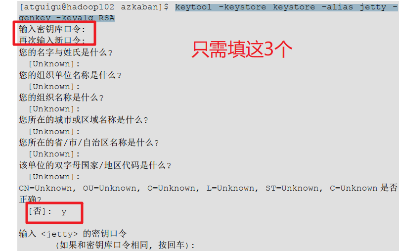

    --检查

    ```
    keytool -keystore keystore -list
    ```

    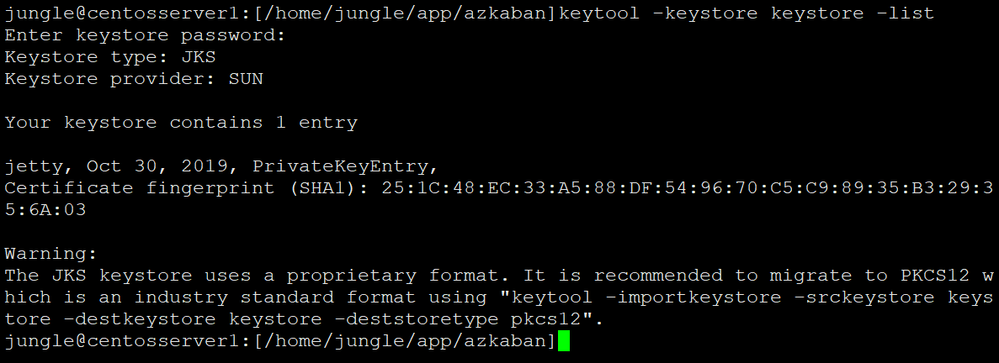

6.   将 keystore 拷贝到 azkaban web 服务器根目录中  

   ```
   mv keystore ~/app/azkaban/server/
   ```
   
7.   进入 azkaban web 服务器安装目录 conf 目录，打开 azkaban.properties 文件  

   ```
   cd ~/app/azkaban/server/conf
   vim azkaban.properties
   ```

   ```properties
   web.resource.dir=/home/jungle/app/azkaban/server/web/
   default.timezone.id=Asia/Shanghai
   user.manager.xml.file=/home/jungle/app/azkaban/server/conf/azkaban-users.xml
   executor.global.properties=/home/jungle/app/azkaban/server/conf/global.properties
   
   database.type=mysql   
   mysql.port=9906       
   mysql.host=192.168.1.18
   mysql.database=azkaban
   mysql.user=root       
   mysql.password=123456                                                           
   mysql.numconnections=100
   
   jetty.maxThreads=25        
   jetty.ssl.port=8443        
   jetty.port=8081            
   jetty.keystore=/home/jungle/app/azkaban/server/keystore
   jetty.password=123456      
   jetty.keypassword=123456   
   jetty.truststore=/home/jungle/app/azkaban/server/keystore
   jetty.trustpassword=123456
   ```

8.   在 azkaban web 服务器安装目录 conf 目录， 按照如下配置修改 azkaban-users.xml 文件，
   增加管理员用户  

   ```
   vim azkaban-users.xml
   ```

   ```
   <user username="admin" password="admin" roles="admin"/>
   ```

   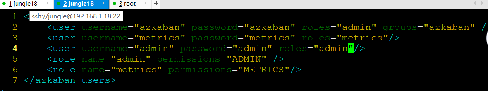

9.  

9.   进入执行服务器安装目录 conf，打开 azkaban.properties  

   ```
   cd executor/conf/
   ```

   ```
   vim azkaban.properties
   ```

   ```properties
   default.timezone.id=Asia/Shanghai 
   executor.global.properties=/home/jungle/app/azkaban/executor/conf/global.properties
   
   database.type=mysql   
   mysql.port=9906       
   mysql.host=192.168.1.18
   mysql.database=azkaban
   mysql.user=root       
   mysql.password=123456                                                           
   mysql.numconnections=100 
   ```

10.   在 executor 服务器目录下执行启动命令  

    ```
    bin/azkaban-executor-start.sh
    ```

11.   在 azkaban web 服务器目录下执行启动命令  

    ```
     bin/azkaban-web-start.sh 
    ```

12. 登录

    ```
    https://192.168.1.18:8443/
    ```

    

## 二、 Azkaban中AJAX API使用 

[参考网址]( https://azkaban.readthedocs.io/en/latest/ajaxApi.html# )

### 1.登录

```
curl -k -X POST --data "action=login&username=azkaban&password=azkaban" http://192.168.1.18:9081
```

```
{
  "session.id" : "97410ddc-d9c8-414d-bd27-389bc692cf7a",
  "status" : "success"
}
```

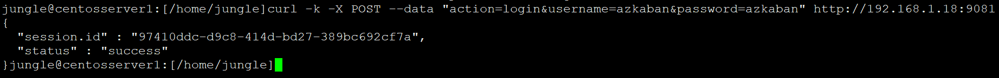

### 2.创建项目

```
curl -k -X POST --data "session.id=97410ddc-d9c8-414d-bd27-389bc692cf7a&name=projectajax&description=projectajax" http://192.168.1.18:9081/manager?action=create
```

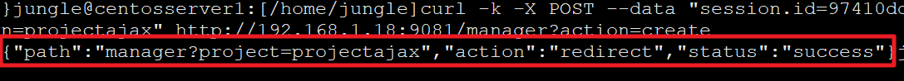

### 3.删除项目

```
curl -k --get --data "session.id=97410ddc-d9c8-414d-bd27-389bc692cf7a&delete=true&project=nanshou" http://192.168.1.18:9081/manager
```

### 4.上传 Project Zip

```
curl -k -i -H "Content-Type: multipart/mixed" -X POST --form 'session.id=6dd538ab-befe-45f1a767-6933287e68d8' --form 'ajax=upload' --form 'file=@hadoop.zip;type=application/zip' --form 'project=ipget' http://192.168.1.18:9081/manager
```

### 5. 获取工作流 

```
curl -k --get --data "session.id=1590ab7a-503a-4430-bf39-21391b83d616&ajax=fetchprojectflows&project=ipget" http://192.168.1.18:9081/manager
```

### 6.提取流程作业

```
curl -k --get --data "session.id=1590ab7a-503a-4430-bf39-21391b83d616&ajax=fetchprojectflows&project=ipget&flow=hadoop" http://192.168.1.18:9081/manager
```

# 第13章 项目实战

## 一、 大数据项目开发流程 

```
大数据项目开发流程
1) 调研
	业务
2) 需求分析
	项目的需求
		显示
		隐式
	甘特图：项目周期管理	
3) 方案设计
	概要设计：多少模块，多少功能点
	详细设计
		基本要求 使用什么技术 哪些类 哪些方法
		系统要求：扩展性、容错性、高可用(HDFS YARN HA???)、定制化
4) 功能开发
	开发
	单元测试  junit
5) 测试
	测试环境 QA 
	功能、性能、压力
	用户测试
6) 部署上线
	试运行   DIFF  “双活”
	正式上线
7) 运维
	7*24
8) 后期迭代开发
```

## 二、 大数据企业级应用 

```
大数据企业级应用
1) 数据分析
	商业
	自研
2）搜索/引擎
	Lucene/Solr/ELK
3）机器学习
4) 精准营销
5) 人工智能

```

## 三、 企业级大数据分析平台 

```
企业级大数据分析平台
1) 商业

2) 自研
	Apache
	CDH
	HDP
```

## 四、 集群数据量预估 

```
数据量预估及集群规划
Q: 一条日志多大、多少个字段、一天多少数据
300~500字节 * 1000W * 5 * 5  =  100G
HDFS 3副本 * 100G * (2~3年)

服务器一台：磁盘多少？ ==> Node数量
	集群规模：数据量 + 存储周期


集群机器规模：
	DN: 数据量大小/每个Node的磁盘大小
	NN: 2
	RM: 2
	NM: DN
	ZK: 3/5/7/9
	GATEWAY: 

资源设置：cpu/memory/disk/network
	
作业规划：
	MapReduce/Hive/Spark
	Server: ***** 
	调度：AZ、OOZIE
```

## 五、 项目需求 

```
数据来源：http://stateair.net/web/historical/1/1.html

根据北京的数据进行统计分析

同时间：北京 vs 广州 vs 成都


空气质量指数     pm2.5 健康建议
0-50          健康
51-100    中等
101-150  对敏感人群不健康
151-200   不健康
201-300 非常不健康
301-500 危险
>500   爆表

数据分析==>es==>kibana
```

## 六、 数据加载成DataFrame并选出需要的列 

```
pyspark --master local[2] --jars /home/jungle/app/hive-1.1.0-cdh5.7.0/lib/mysql-conne27-bin.jar
```

```
df = spark.read.format("csv").load("file:///home/jungle/data/Beijing_2017_HourlyPM25_created20170803.csv")
```

```
UI:http://192.168.1.18:4040/jobs/
```

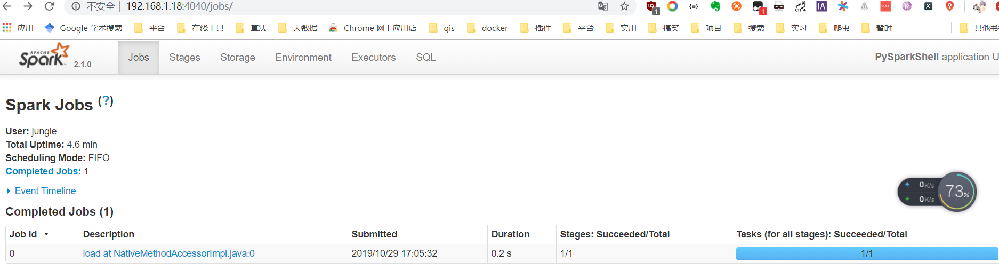

```
df.show()
```

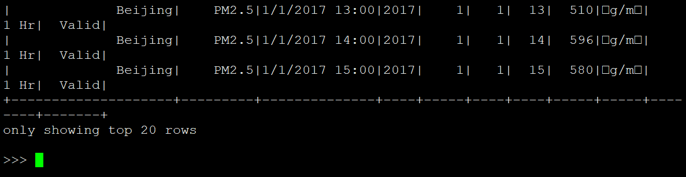

==不需要另外加表头==

```
df = spark.read.format("csv").option("header","true").option("inferSchema","true").load("file:///home/jungle/data/Beijing_2017_HourlyPM25_created20170803.csv")
```

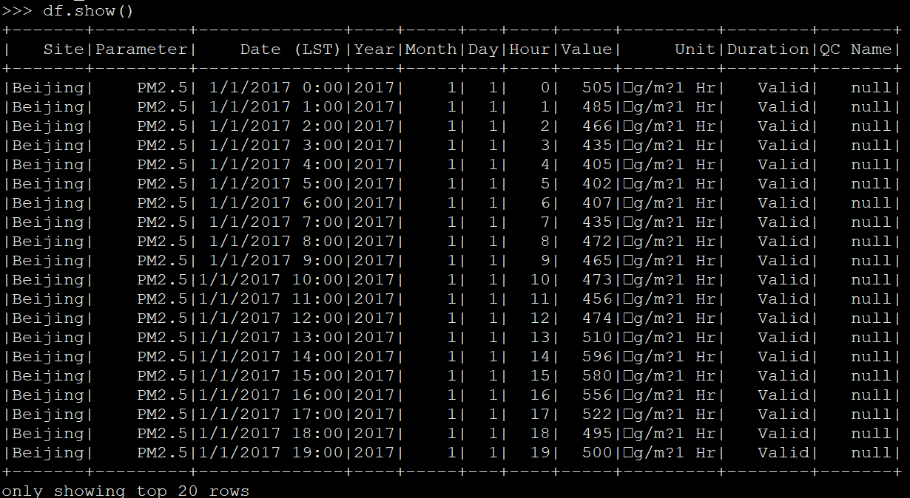

```
df.printSchema()
```

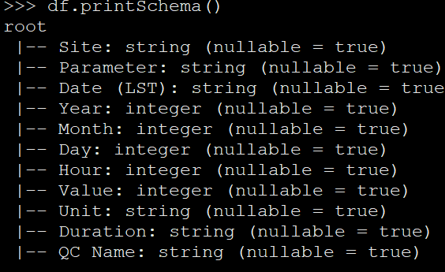

```
df.select("Year","Month","Day","Hour","Value","QC Name").show()
```

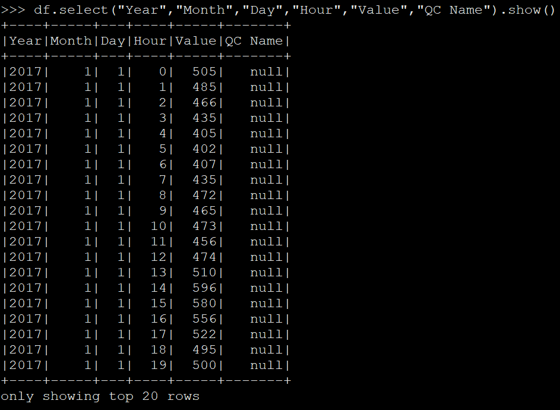

## 七、 SparkSQL UDF函数开发 

```
from pyspark.sql.types import *
from pyspark.sql.functions import udf
grade_function_udf = udf(get_grade(),StringType())
```

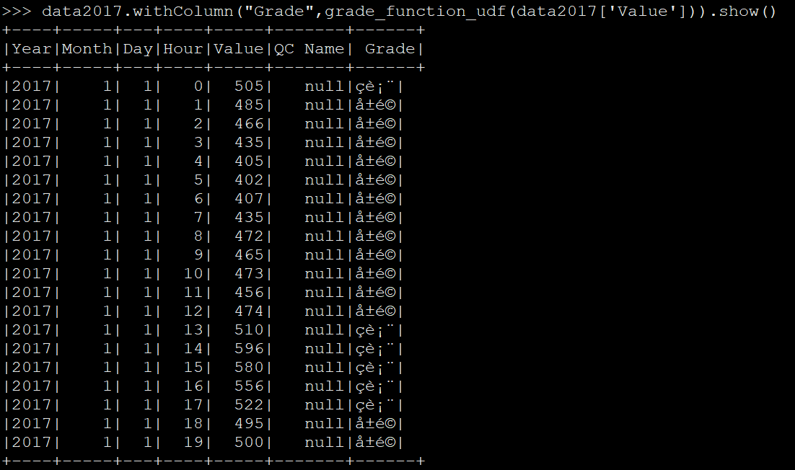

```
data2017.withColumn("Grade",grade_function_udf(data2017['Value'])).groupBy("Grade").count().show()
```

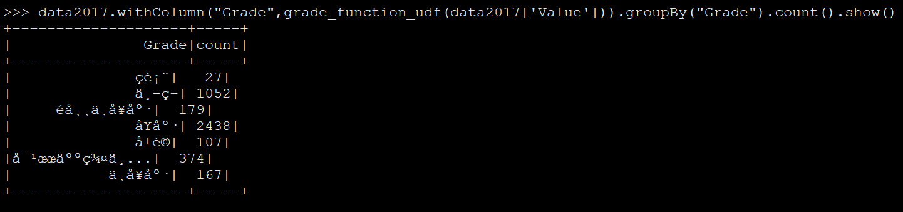

```python
# udf 转换
    # UDF的全称为user-defined function，用户定义函数
    grade_function_udf = udf(get_grade(),StringType())

    # 进来一个Value，出去一个Grade
    # 添加列
    group2017 = data2017.withColumn("Grade",grade_function_udf(data2017['Value'])).groupBy("Grade").count()
    group2016 = data2016.withColumn("Grade",grade_function_udf(data2016['Value'])).groupBy("Grade").count()
    group2015 = data2015.withColumn("Grade",grade_function_udf(data2015['Value'])).groupBy("Grade").count()
```

## 八、 Grade在每年中的占比统计  

```
group2017.select("Grade", "count", group2017['count'] / data2017.count()).show()
```

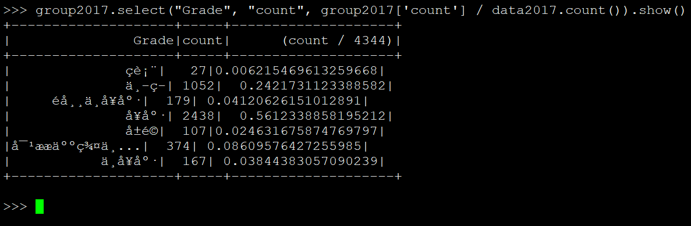

## 九、 ES部署及使用 

==视频中的版本是6.3.0==

```
tar -zxvf elasticsearch-6.3.0-linux-x86_64.tar.gz -C ~/app/
```

```
vi /home/jungle/app/elasticsearch-6.3.0/config/elasticsearch.yml
```

```
bootstrap.system_call_filter: false
network.host: 0.0.0.0 
```

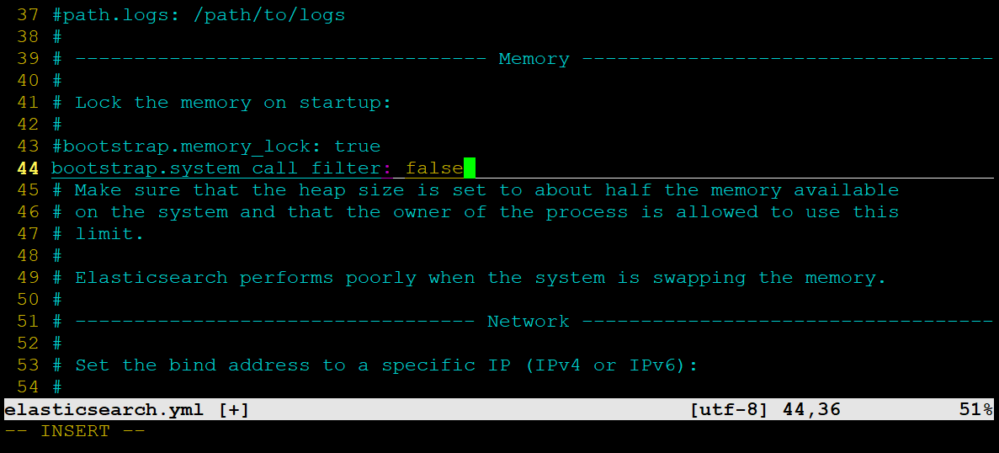

启动

```
cd bin
./elasticsearch
```

---

[elasticsearch下载]( https://www.elastic.co/cn/downloads/ )

### 第一步：node.js环境配置

获取nvm源码

```
$ cd ~/software/
$ wget https://github.com/cnpm/nvm/archive/v0.23.0.tar.gz
//或者通过git从github拉取
$ git clone https://github.com/cnpm/nvm.git
```

解压并进入nvm目录

```js
$ tar xzf v0.23.0.tar.gz -C ~/app
$ cd nvm-0.23.0
```

进入目录开始安装

```js
//安装
$ ./install.sh 
//添加淘宝镜像地址
$ export NVM_NODEJS_ORG_MIRROR=https://npm.taobao.org/dist 
//重启配置文件
$ source ~/.bash_profile
```

自此已经安装好了nvm,查看nvm是否安装成功

```js
//若无此命令 请重新输入 soruce ~/.bash_profile 命令
$ nvm list
```

接下来开始安装node.js

```js
//安装node.js
$ nvm install 7.8.0
$ nvm alias default v7.8.0
```

安装cnpm , pm2

```js
//安装cnpm
$ npm install -g cnpm -registry=https://registry.npm.taobao.org
$ cnpm install pm2 -g
```

### 第二步：安装Elasticsearch  

```
tar -zxvf elasticsearch-5.2.2.tar.gz -C ~/app/
```

在elasticsearch-5.2.2路径下创建data和logs文件夹

```
cd ~/app/elasticsearch-5.2.2
```

```
mkdir data
mkdir logs
```

修改配置文件~/app/elasticsearch-5.2.2/config/elasticsearch.yml  

```
vi ~/app/elasticsearch-5.2.2/config/elasticsearch.yml 
```

```
node.name: node-18
path.data: /home/jungle/app/elasticsearch-5.2.2/data
path.logs: /home/jungle/app/elasticsearch-5.2.2/logs
bootstrap.memory_lock: false
bootstrap.system_call_filter: false
network.host: 192.168.1.18 
discovery.zen.ping.unicast.hosts: ["centosserver1"]
```

### 第三步：配置linux系统环境  

1.切换到root用户，编辑limits.conf 添加类似如下内容

```
jungle@centosserver1:[/home/jungle] sudo -i 
[sudo] password for jungle:
```

```
 vi /etc/security/limits.conf
```

```
* soft nofile 65536
* hard nofile 131072
* soft nproc 2048
* hard nproc 4096
```

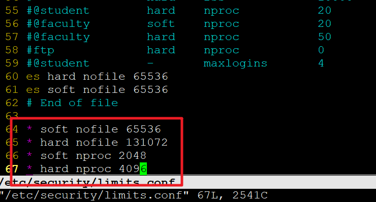

 2.切换到root用户，进入limits.d目录下修改配置文件。  

```
cd /etc/security/limits.d/
ll
vi 20-nproc.conf
```

```
* soft nproc 1024
#修改为
* soft nproc 2048
```

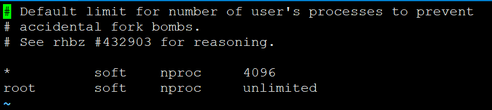

3.切换到root用户修改配置sysctl.conf

```
vim /etc/sysctl.conf
```

添加下面配置：

```
vm.max_map_count=655360
```

并执行命令：

```
sysctl -p
```

然后，重新启动elasticsearch，即可启动成功。

```
bin/elasticsearch
```


---
创建索引库

```
curl -XPUT 'http://192.168.1.18:9200/imooc_es'
```

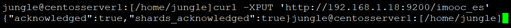

```
curl -XGET 'http://192.168.1.18:9200/_search'
```

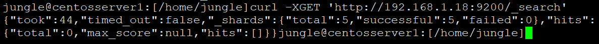

```
curl -XPOST 'http://192.168.1.18:9200/imooc_es/student/1' -H 'Content-Type: application/json' -d '{
"name":"imooc",
"age":5,
"interests":["Spark","Hadoop"]	
}'
```

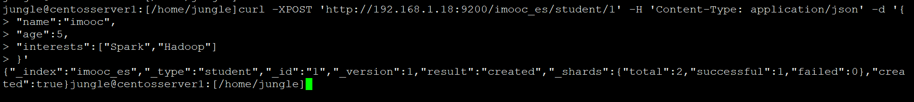

```
curl -XGET 'http://192.168.1.18:9200/_search?pretty'
```

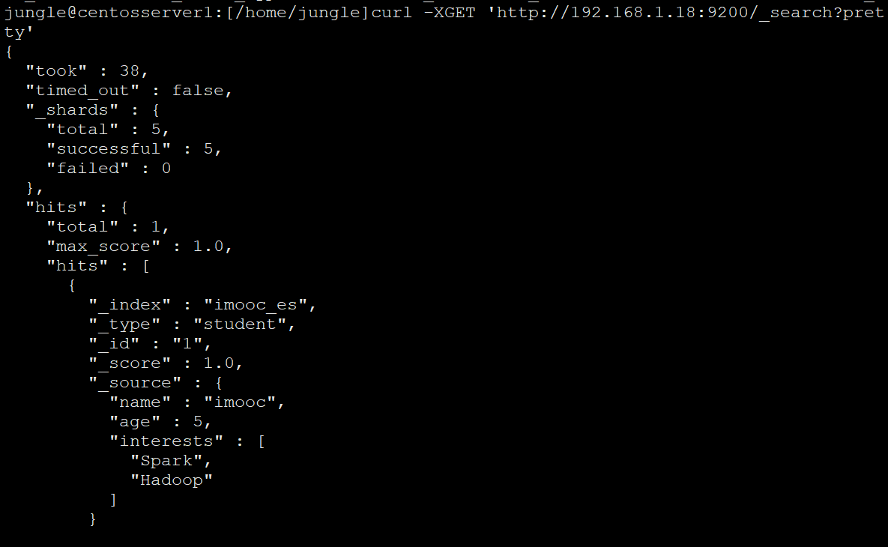

---

## 十、 Kibana部署及使用 

[下载地址](  https://www.elastic.co/cn/downloads/past-releases/kibana-5-2-2  )

```
wget https://artifacts.elastic.co/downloads/kibana/kibana-5.2.2-linux-x86_64.tar.gz
```

```
tar -zxvf kibana-5.2.2-linux-x86_64.tar.gz -C ~/app/
```

```
cd config/
```

```
vim kibana.yml
```

```
server.port: 5601
server.host: "0.0.0.0"
elasticsearch.url: "http://192.168.1.18:9200"
```

启动

```
bin/kibana
```

ui界面

```
http://192.168.1.18:5601
```

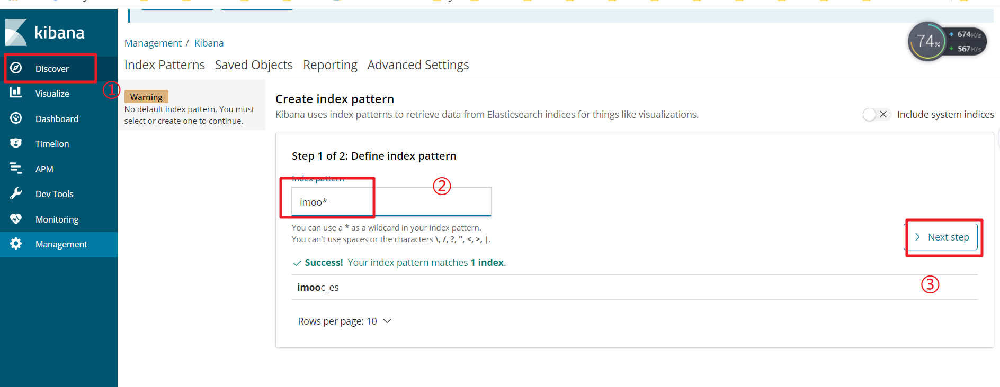

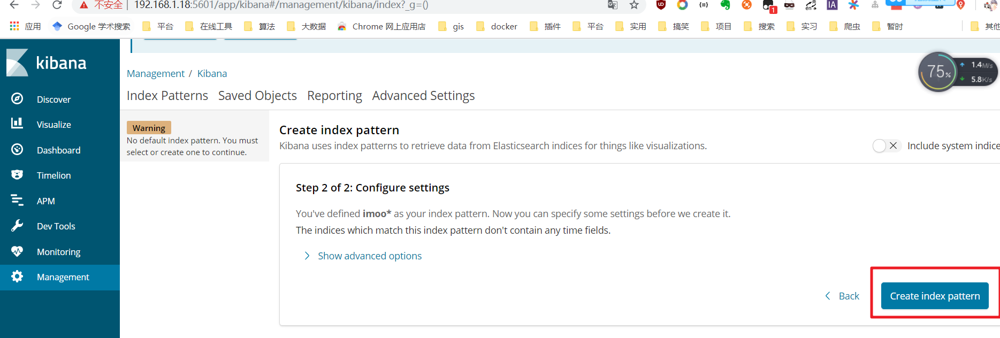

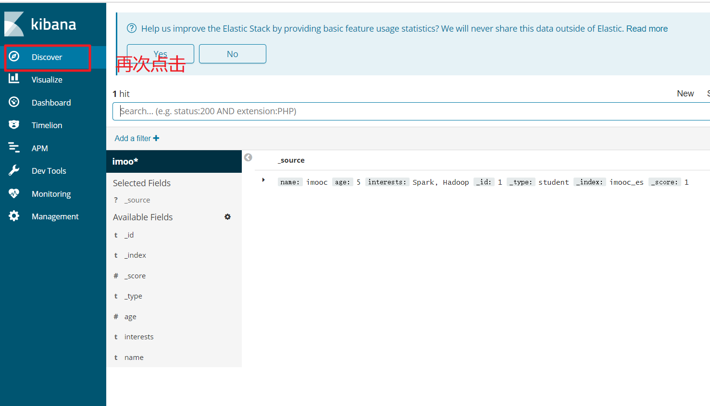

---

## 甲、 将作业运行到YARN上 

把csv文件上传至hdfs

```
hadoop fs -ls /
hadoop fs -mkdir -p /data/
hadoop fs -put Beijing* /data/
hadoop fs -ls /data/
```

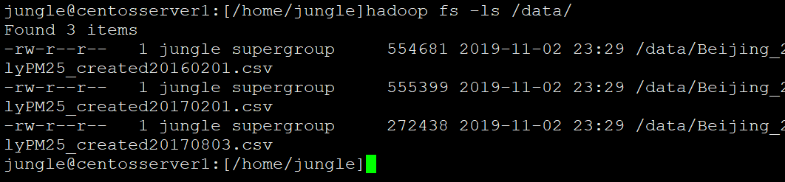

--sparkyarn.py

```python
# !/usr/bin/env python
# encoding: utf-8
import sys                                                                                                                            
reload(sys)
sys.setdefaultencoding('utf8')
from pyspark.sql import SparkSession
from pyspark.sql.types import *
from pyspark.sql.functions import udf 
 
 
def get_grade(value):
    if value <= 50 and value >= 0:
        return "健康"
    elif value <= 100:
        return "中等"
    elif value <= 150:
        return "对敏感人群不健康"
    elif value <= 200:
        return "不健康"
    elif value <= 300:
        return "非常不健康"
    elif value <= 500:
        return "危险"
    elif value > 500:
        return "爆表"
    else:
        return None
if __name__ == '__main__':
    spark = SparkSession.builder.appName("project").getOrCreate()
 
 
    # 读取hdfs上的数据
    data2017 = spark.read.format("csv").option("header","true").option("inferSchema","true").load("/data/Beijing_2017_HourlyPM25_creat
    data2016 = spark.read.format("csv").option("header","true").option("inferSchema","true").load("/data/Beijing_2016_HourlyPM25_creat
    data2015 = spark.read.format("csv").option("header","true").option("inferSchema","true").load("/data/Beijing_2015_HourlyPM25_creat
 
    # udf 转换
    # UDF的全称为user-defined function，用户定义函数
    grade_function_udf = udf(get_grade,StringType())
 
    # 进来一个Value，出去一个Grade
    # 添加列
    group2017 = data2017.withColumn("Grade",grade_function_udf(data2017['Value'])).groupBy("Grade").count()
    group2016 = data2016.withColumn("Grade",grade_function_udf(data2016['Value'])).groupBy("Grade").count()
    group2015 = data2015.withColumn("Grade",grade_function_udf(data2015['Value'])).groupBy("Grade").count()
 
    group2015.select("Grade", "count", group2015['count'] / data2015.count()).show()
    group2016.select("Grade", "count", group2016['count'] / data2016.count()).show()
    group2017.select("Grade", "count", group2017['count'] / data2017.count()).show()
 
 
    spark.stop()  
```

将sparkyarn.py上传至服务器

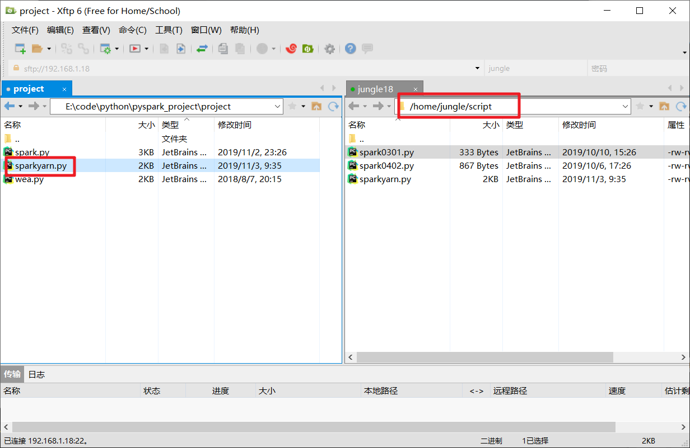

+ 启动yarn

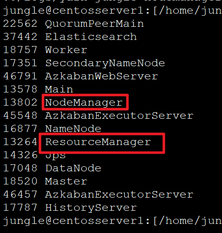

```
http://192.168.1.18:8088
```

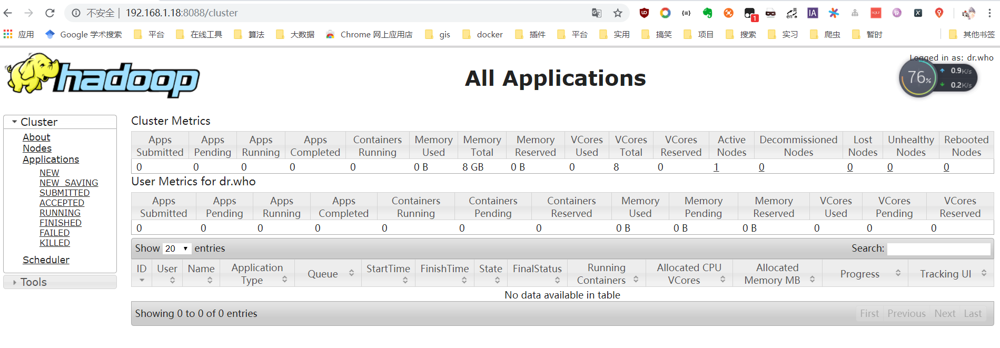

----

```
spark-submit --master yarn ~/script/sparkyarn.py
```

> 报错：UnicodeEncodeError: 'ascii' codec can't encode characters in position 162-167: ordinal not in range(

==修正==

```
# 添加
import sys  
reload(sys)  
sys.setdefaultencoding('utf8')   
```

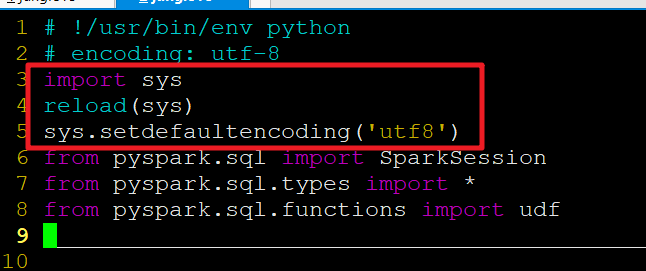

## 乙、 统计分析结果写入ES测试 

使用SparkSQL将统计结果写入到ES中去

需要一个jar包,  [elasticsearch-spark-20_2.11](https://mvnrepository.com/artifact/org.elasticsearch/elasticsearch-spark-20_2.11) » 6.3.0 

==可以去maven仓库中下载==

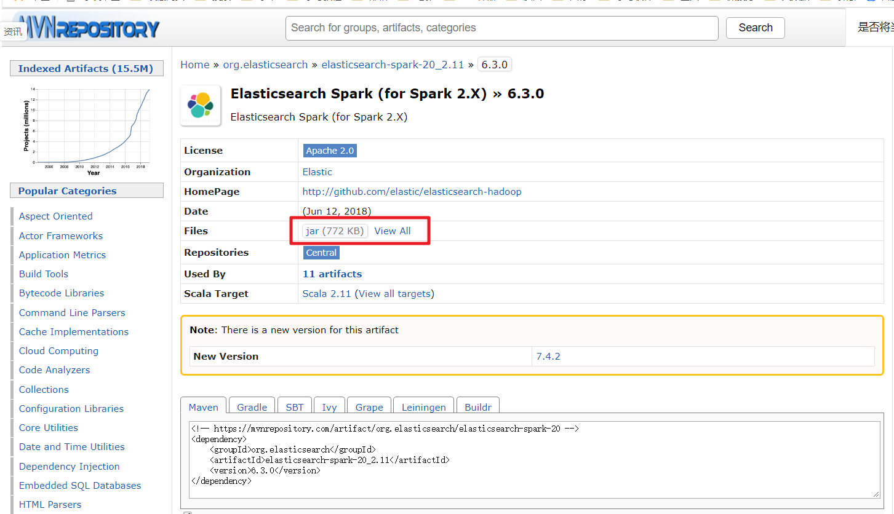

```
cd lib/
wget https://repo1.maven.org/maven2/org/elasticsearch/elasticsearch-spark-20_2.11/6.3.0/elasticsearch-spark-20_2.11-6.3.0.jar
```

```
pyspark --master local[2] --jars ~/lib/elasticsearch-spark-20_2.11-6.3.0.jar
```

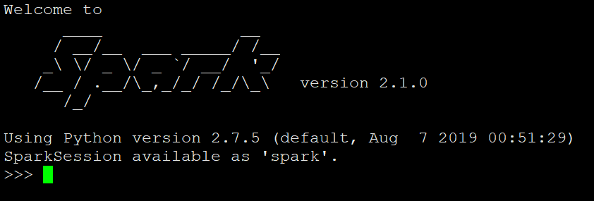

```python
from pyspark.sql.types import *
from pyspark.sql.functions import udf


def get_grade(value):
    if value <= 50 and value >= 0:
        return "健康"
    elif value <= 100:
        return "中等"
    elif value <= 150:
        return "对敏感人群不健康"
    elif value <= 200:
        return "不健康"
    elif value <= 300:
        return "非常不健康"
    elif value <= 500:
        return "危险"
    elif value > 500:
        return "爆表"
    else:
        return None

data2017 = spark.read.format("csv").option("header","true").option("inferSchema","true").load("/data/Beijing_2017_HourlyPM25_created20170803.csv").select("Year","Month","Day","Hour","Value","QC Name")
grade_function_udf = udf(get_grade,StringType())
group2017 = data2017.withColumn("Grade",grade_function_udf(data2017['Value'])).groupBy("Grade").count()
result2017 = group2017.select("Grade", "count", group2017['count'] / data2017.count())
```

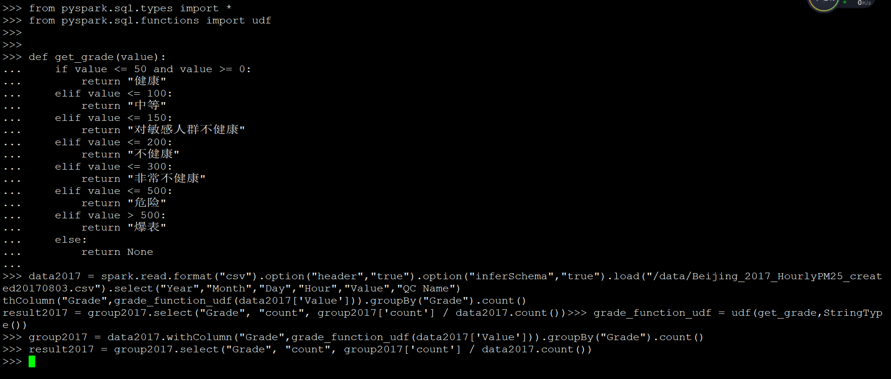

```
result2017.show()
```

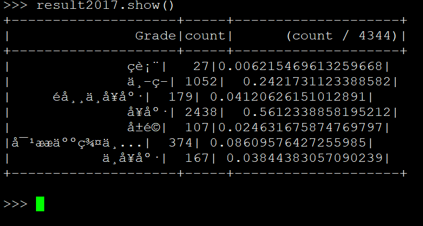

```
result2017.printSchema()
```

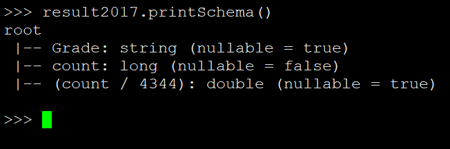

```
result2017.write.format("org.elasticsearch.spark.sql").option("es.nodes","192.168.1.18:9200").mode("overwrite").save("weaes/weather")
```

----


```
result2017_2=group2017.select("Grade", "count").withColumn("precent",group2017['count'] / data2017.count()*100)
```

```
result2017_2.selectExpr("Grade as grade", "count", "precent").write.format("org.elasticsearch.spark.sql").option("es.nodes","192.168.1.18:9200").mode("overwrite").save("weaes/weather")
```

---

--wea.py

```python
from pyspark.sql import SparkSession
from pyspark.sql.types import *
from pyspark.sql.functions import udf


def get_grade(value):
    if value <= 50 and value >= 0:
        return "健康"
    elif value <= 100:
        return "中等"
    elif value <= 150:
        return "对敏感人群不健康"
    elif value <= 200:
        return "不健康"
    elif value <= 300:
        return "非常不健康"
    elif value <= 500:
        return "危险"
    elif value > 500:
        return "爆表"
    else:
        return None

if __name__ == '__main__':
    spark = SparkSession.builder.appName("project").getOrCreate()


    # 读取hdfs上的数据
    data2017 = spark.read.format("csv").option("header","true").option("inferSchema","true").load("/data/Beijing_2017_HourlyPM25_created20170803.csv").select("Year","Month","Day","Hour","Value","QC Name")
    data2016 = spark.read.format("csv").option("header","true").option("inferSchema","true").load("/data/Beijing_2016_HourlyPM25_created20170201.csv").select("Year","Month","Day","Hour","Value","QC Name")
    data2015 = spark.read.format("csv").option("header","true").option("inferSchema","true").load("/data/Beijing_2015_HourlyPM25_created20160201.csv").select("Year","Month","Day","Hour","Value","QC Name")

    # udf 转换
    # UDF的全称为user-defined function，用户定义函数
    grade_function_udf = udf(get_grade,StringType())

    # 进来一个Value，出去一个Grade
    # 添加列
    group2017 = data2017.withColumn("Grade",grade_function_udf(data2017['Value'])).groupBy("Grade").count()
    group2016 = data2016.withColumn("Grade",grade_function_udf(data2016['Value'])).groupBy("Grade").count()
    group2015 = data2015.withColumn("Grade",grade_function_udf(data2015['Value'])).groupBy("Grade").count()

    result2017 = group2017.select("Grade", "count").withColumn("precent", group2017['count'] / data2017.count() * 100)
    result2016 = group2016.select("Grade", "count").withColumn("precent", group2016['count'] / data2016.count() * 100)
    result2015 = group2015.select("Grade", "count").withColumn("precent", group2015['count'] / data2015.count() * 100)

    result2017.selectExpr("Grade as grade", "count", "precent").write.format("org.elasticsearch.spark.sql").option(
        "es.nodes", "192.168.1.18:9200").mode("overwrite").save("weather2017/pm")
    result2016.selectExpr("Grade as grade", "count", "precent").write.format("org.elasticsearch.spark.sql").option(
        "es.nodes", "192.168.1.18:9200").mode("overwrite").save("weather2016/pm")
    result2015.selectExpr("Grade as grade", "count", "precent").write.format("org.elasticsearch.spark.sql").option(
        "es.nodes", "192.168.1.18:9200").mode("overwrite").save("weather2015/pm")

    spark.stop()
```

```
spark-submit --master local[2] --jars ~/lib/elasticsearch-spark-20_2.11-6.3.0.jar ~/script/wea.py
```

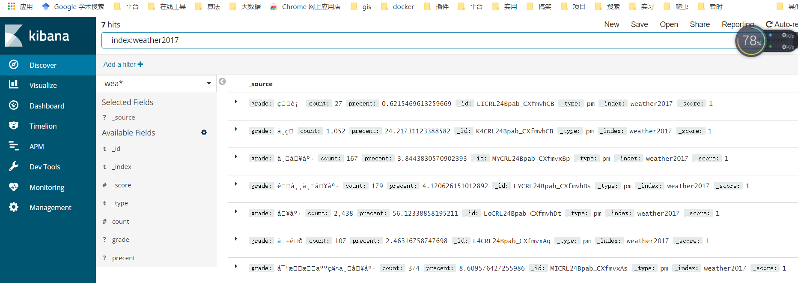

## 丙、 Kibana图形化展示 

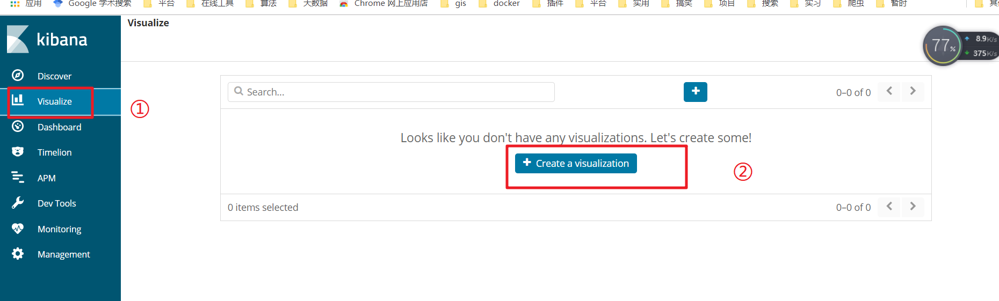

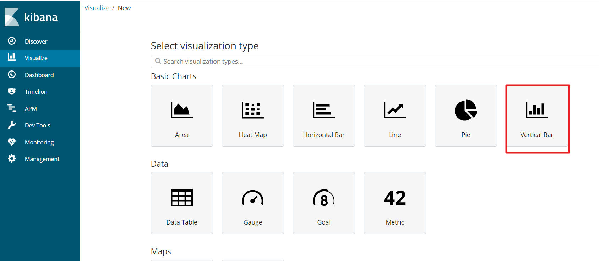

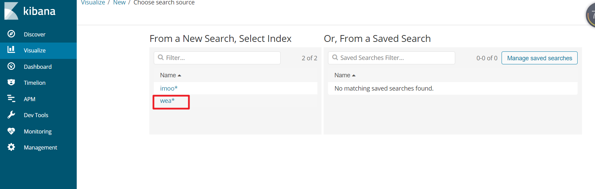

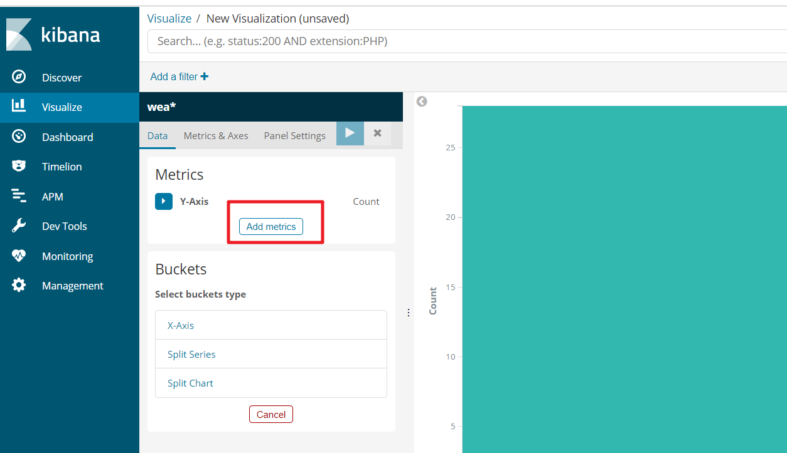

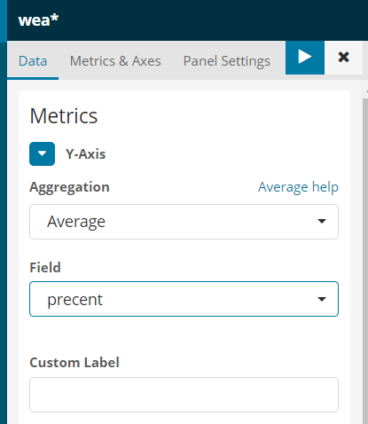

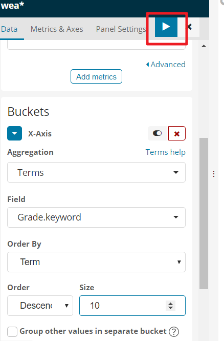

```
# 删除es中不想要的数据
curl -XDELETE 'http://192.168.1.18:9200/weaes'
```


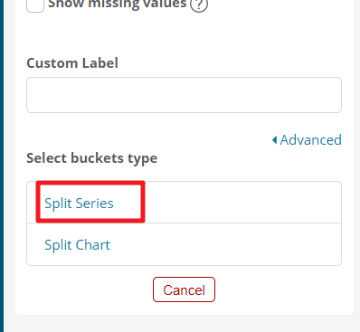

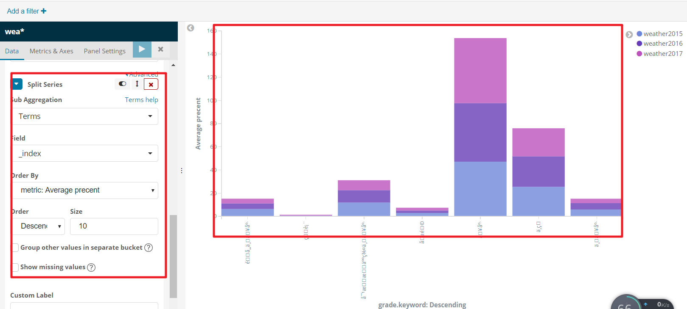

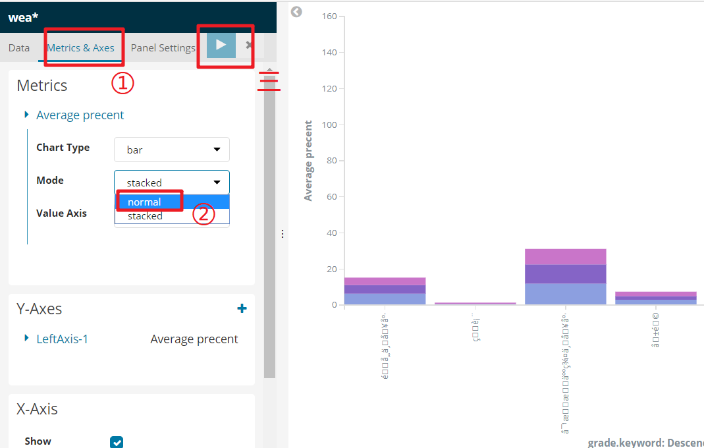

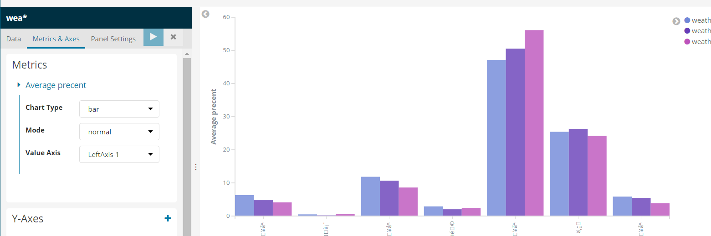

==保存==

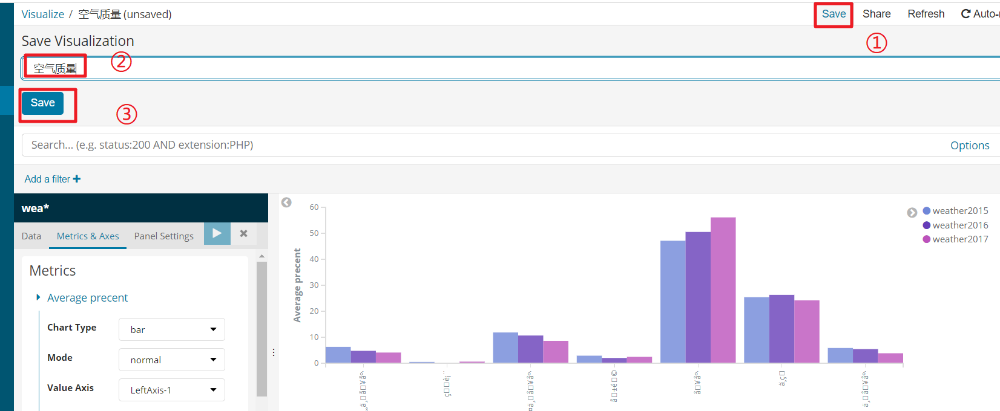

